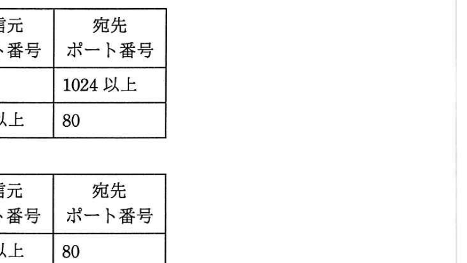

# 平成29年度 春期 基本情報技術者試験 午前 問題

## 試験概要情報

**試験時間:** 9:30 ～ 12:00 (2時間30分)

**問題範囲:** 問1～問80 (全問必須)

**選択方法:** 全問必須

## 注意事項

### 受験に関する基本注意事項
1. 試験開始及び終了は、監督員の時計が基準です。監督員の指示に従ってください。
2. 試験開始の合図があるまで、問題冊子を開いて中を見てはいけません。
3. 答案用紙への受験番号などの記入は、試験開始の合図があってから始めてください。
4. 問題は、次の表に従って解答してください。

### 答案用紙記入に関する注意事項
5. 答案用紙の記入に当たっては、次の指示に従ってください。

(1) 答案用紙は光学式読取り装置で読み取った上で採点しますので、B又はHBの黒鉛筆で答案用紙のマークの記入方法のとおりマークしてください。マークの濃度がうすいなど、マークの記入方法のとおり正しくマークされていない場合は、読み取れません。特にシャープペンシルを使用する際には、マークの濃度に十分ご注意ください。訂正の場合は、あとが残らないように消しゴムできれいに消し、消しくずを残さないでください。

(2) 受験番号欄に受験番号を、生年月日欄に受験票の生年月日を記入及びマークしてください。答案用紙のマークの記入方法のとおり記入及びマークされていない場合は、採点されないことがあります。生年月日欄については、受験票の生年月日を訂正した場合でも、訂正前の生年月日を記入及びマークしてください。

(3) 解答は、次の例題になって、解答欄に一つだけマークしてください。答案用紙のマークの記入方法のとおりマークされていない場合は、採点されません。

[例題] 春の情報処理技術者試験が実施される月はどれか。
ア 2　イ 3　ウ 4　エ 5

正しい答えは"ウ 4"ですから、次のようにマークしてください。

[IMAGE: 1-2] 例題解答マーク例
位置情報: (280,1040,140,30)
内容説明: 選択肢ア、イ、ウ、エのマーク欄で、ウが黒塗りされた状態を示す

**注意事項は問題冊子の裏表紙に続きます。こちら側から裏返して、必ず読んでください。**

---

## 問1 集合の等式問題

集合 A, B, C を使った等式のうち、集合 A, B, C の内容によらず常に成立する等式はどれか。ここで、∪は和集合、∩は積集合を示す。

- ア　$(A∪B) ∩ (A∩C) = B ∩ (A∪C)$
- イ　$(A∪B) ∩ C = (A∪C) ∩ (B∪C)$
- ウ　$(A∩C) ∪ (B∩A) = (A∩B) ∪ (B∩C)$
- エ　$(A∩C) ∪ (B∩C) = (A∪B) ∩ C$

---

## 問2 浮動小数点表現問題

0 以外の数値を浮動小数点表示で表現する場合、仮数部の最上位桁が 0 以外になるように、桁合わせする操作はどれか。ここで、仮数部の表現方法は、絶対値表現とする。

- ア　切上げ
- イ　切捨て
- ウ　桁上げ
- エ　正規化

---

## 問3 論理演算問題

$X$ と $Y$ の否定論理積 $X$ NAND $Y$ は、NOT $(X$ AND $Y)$ として定義される。
$X$ OR $Y$ を NAND だけを使って表した論理式はどれか。

- ア　$((X$ NAND $Y)$ NAND $X)$ NAND $Y$
- イ　$(X$ NAND $X)$ NAND $(Y$ NAND $Y)$
- ウ　$(X$ NAND $Y)$ NAND $(X$ NAND $Y)$
- エ　$X$ NAND $(Y$ NAND $(X$ NAND $Y))$

---

## 問4 データ構造とリスト問題

データ構造の一つであるリストは、配列を用いて実現する場合と、ポインタを用いて実現する場合とがある。配列を用いて実現する場合の特徴はどれか。ここで、配列を用いたリストは、配列に要素を連続して格納することによって構成し、ポインタを用いたリストは、要素から次の要素へポインタで連結することによって構成するものとする。

- ア　位置を指定して、任意のデータに直接アクセスすることができる。
- イ　並んでいるデータの先頭に任意のデータを効率的に挿入することができる。
- ウ　任意のデータの参照は効率的ではないが、削除や挿入の操作を効率的に行える。
- エ　任意のデータを別の位置に移動する場合、隣接するデータを移動せずにできる。

---

## 問5 シフト演算とビット操作問題

次の流れ図は、シフト演算と加算の繰返しによって 2 進整数の乗算を行う手順を表したものである。この流れ図中の a，b の組合せとして、適切なものはどれか。ここで、乗数と被乗数は符号なしの 16 ビットで表される。X，Y，Z は 32 ビットのレジスタであり、桁送りには論理シフトを用いる。最下位ビットを第 0 ビットと記す。

[IMAGE: 5-2] 選択肢表
位置情報: (150,850,550,150)
内容説明: a,bの組み合わせ表。ア:Yの第0ビット/Xを1ビット左シフト,Yを1ビット右シフト、イ:Yの第0ビット/Xを1ビット右シフト,Yを1ビット左シフト、ウ:Yの第15ビット/Xを1ビット左シフト,Yを1ビット右シフト、エ:Yの第15ビット/Xを1ビット右シフト,Yを1ビット左シフト

---

## 問6 再帰関数問題

関数 $f(x, y)$ が次のとおり定義されているとき、$f(775, 527)$ の値は幾らか。ここで、$x$ mod $y$ は $x$ を $y$ で割った余りを返す。

$f(x, y):$ if $y = 0$ then return $x$ else return $f(y, x$ mod $y)$

- ア　0
- イ　31
- ウ　248
- エ　527

---

## 問7 データ構造と検索問題

顧客番号をキーとして顧客データを検索する場合、2 分探索を使用するのが適している場合はどれか。

- ア　顧客番号から求めたハッシュ値が指し示す位置に配置されているデータ構造
- イ　顧客番号に関係なく、ランダムに配置されているデータ構造
- ウ　顧客番号の昇順に配置されているデータ構造
- エ　顧客番号をセルに格納し、セルのアドレス順に配置されているデータ構造

---

## 問8 CPU性能とMIPS問題

動作クロック周波数が 700MHz の CPU で、命令実行に必要なクロック数及びその命令の出現率が表に示す値である場合、この CPU の性能は約何 MIPS か。

- ア　10
- イ　50
- ウ　70
- エ　100

---

## 問9 キャッシュメモリ問題

キャッシュの書込み方式には、ライトスルー方式とライトバック方式がある。ライトバック方式を使用する目的として、適切なものはどれか。

- ア　キャッシュと主記憶の一貫性（コヒーレンシ）を保ちながら、書込みを行う。
- イ　キャッシュミスが発生したときに、キャッシュの内容の主記憶への書き戻しを不要にする。
- ウ　個々のプロセッサがそれぞれのキャッシュをもつマルチプロセッサシステムにおいて、キャッシュ管理をライトスルー方式よりも簡単な回路構成で実現する。
- エ　プロセッサから主記憶への書込み頻度を減らす。

---

## 問10 USB 3.0問題

USB 3.0 の説明として、適切なものはどれか。

- ア　1クロックで2ビットの情報を伝送する4対の信号線を使用し、最大1Gビット/秒のスループットをもつインタフェースである。
- イ　PCと周辺機器とを接続するATA仕様をシリアル化したものである。
- ウ　音声、映像などに適したアイソクロナス転送を採用しており、ブロードキャスト転送モードをもつシリアルインタフェースである。
- エ　スーパースピードと呼ばれる5Gビット/秒のデータ転送モードをもつシリアルインタフェースである。

---

## 問11 RAID問題

4Tバイトのデータを格納できるように RAID1 の外部記憶装置を構成するとき、フォーマット後の記憶容量が1Tバイトの磁気記憶装置は少なくとも何台必要か。

- ア　4
- イ　5
- ウ　6
- エ　8

---

## 問12 スケールアウト問題

システムの性能を向上させるために、スケールアウトが適しているシステムはどれか。

- ア　一連の大きな処理を一括して実行しなければならないので、並列処理が困難な処理が中心のシステム
- イ　参照系のトランザクションが多いので、複数のサーバで分散処理を行っているシステム
- ウ　データを追加するトランザクションが多いので、データの整合性を取るためのオーバーヘッドを小さくしなければならないシステム
- エ　同一のマスタデータベースがシステム内に複数配置されているので、マスタを更新する際にはデータベース間で整合性を保持しなければならないシステム

---

## 問13 ベンチマークテスト問題

ベンチマークテストの説明として、適切なものはどれか。

- ア　監視・計測用のプログラムによってシステムの稼働状態や資源の状況を測定し、システム構成や応答性能のデータを得る。
- イ　使用目的に合わせて選定した標準的なプログラムを実行させ、システムの処理性能を測定する。
- ウ　将来の予測を含めて評価する場合などに、モデルを作成して模擬的に実験するプログラムでシステムの性能を評価する。
- エ　プログラムを実際には実行せずに、机上でシステムの処理を解析して、個々の命令の出現回数や実行回数の予測値から処理時間を推定し、性能を評価する。

---

## 問14 抵抗回路の稼働率問題

稼働率 R の装置を図のように接続したシステムがある。このシステム全体の稼働率を表す式はどれか。ここで、並列に接続されている部分はどちらかの装置が稼働していればよく、直列に接続されている部分は両方の装置が稼働していなければならない。

- ア　$(1-(1-R^2))^2$
- イ　$1-(1-R^2)^2$
- ウ　$(1-(1-R)^2)^2$
- エ　$1-(1-R)^4$

---

## 問15 ページング方式問題

ページング方式の説明として、適切なものはどれか。

- ア　仮想記憶空間と実記憶空間をそれぞれ固定長の領域に区切り、対応づけて管理する方式
- イ　主記憶装置の異なった領域で実行できるように、プログラムを再配置する方式
- ウ　主記憶装置を、同時に並行して読み書き可能な複数の領域に分ける方式
- エ　補助記憶装置に、複数のレコードをまとめて読み書きする方式

---

## 問16 ジョブスケジューリング問題

四つのジョブ A～D を次の条件で実行し印刷する。全ての印刷が完了するのは、ジョブを起動してから何秒後か。

### 【条件】
(1) ジョブは一斉に起動され、多重度1で実行される。
(2) 優先順位は A が最も高く、B, C, D の順に低くなる。
(3) 各ジョブの実行後、スプーリング機能が1台のプリンタを用いて逐次印刷を行う。
(4) 各ジョブを単独で実行した場合の実行時間と印刷時間は、表のとおりである。
(5) その他のオーバーヘッドは考慮しない。

- ア　100
- イ　160
- ウ　190
- エ　280

---

## 問17 バッファ容量問題

図の送信タスクから受信タスクに T 秒間連続してデータを送信する。1秒当たりの送信量を S，1秒当たりの受信量を R としたとき、バッファがオーバフローしないバッファサイズ L を表す関係式として適切なものはどれか。ここで、受信タスクよりも送信タスクの方が転送速度は速く、次の転送開始までの時間間隔は十分にあるものとする。

- ア　$L < (R - S) × T$
- イ　$L < (S - R) × T$
- ウ　$L ≥ (R - S) × T$
- エ　$L ≥ (S - R) × T$

---

## 問18 ディレクトリ構造問題

A, B という名の複数のディレクトリが、図に示す構造で管理されている。"YBYAYB" がカレントディレクトリになるのは、カレントディレクトリをどのように移動した場合か。ここで、ディレクトリの指定は次の方法によるものとし、→は移動の順序を示す。

### 【ディレクトリ指定方法】
(1) ディレクトリは、"ディレクトリ名¥…¥ディレクトリ名" のように、経路上のディレクトリを順に "¥" で区切って並べた後に、"¥" とディレクトリ名を指定する。
(2) カレントディレクトリは、"." で表す。
(3) 1階層上のディレクトリは、".." で表す。
(4) 始まりが "¥" のときは、左端にルートディレクトリが省略されているものとする。
(5) 始まりが "¥", ".", ".." のいずれでもないときは、左端に ".¥" が省略されているものとする。

- ア　¥A → .¥B → .¥AYB
- イ　¥B → .¥BYA → .¥B
- ウ　¥B → ¥A → ¥B
- エ　¥BYA → .¥B

---

## 問19 仮想記憶とページ置換問題

仮想記憶方式のコンピュータにおいて、実記憶に割り当てられるページ数は 3 とし、追い出すページを選ぶアルゴリズムは、FIFO と LRU の二つを考える。あるタスクのページのアクセス順序が
1, 3, 2, 1, 4, 5, 2, 3, 4, 5
のとき、ページを置き換える回数の組合せとして、適切なものはどれか。

---

## 問20 D/A変換器問題

分解能が 8 ビットの D/A 変換器に、ディジタル値 0 を入力したときの出力電圧が 0 V となり、ディジタル値 128 を入力したときの出力電圧が 2.5 V となる場合、最下位の 1 ビットの変化による当該 D/A 変換器の出力電圧の変化は何 V か。

- ア　$2.5/128$
- イ　$2.5/255$
- ウ　$2.5/256$
- エ　$2.5/512$

---

## 問21 センサ問題

変形を感知するセンサを用いると、高架道路などの状態を監視してメンテナンスすることが可能である。この目的で使用されているセンサはどれか。

- ア　サーミスタ
- イ　ジャイロ
- ウ　ひずみゲージ
- エ　ホール素子

---

## 問22 半加算器問題

図に示す，1桁の2進数 x と y を加算して，z（和の1桁目）及び c（桁上げ）を出力する半加算器において，A と B の素子の組合せとして，適切なものはどれか。

---

## 問23 顧客コード桁数問題

顧客に，A～Z の英大文字 26 種類を用いた顧客コードを割り当てたい。現在の顧客総数は 8,000 人であって，毎年 2 割ずつ顧客が増えていくものとする。3 年後まで全顧客にコードを割り当てられるようにするためには，顧客コードは少なくとも何桁必要か。

- ア　3
- イ　4
- ウ　5
- エ　6

---

## 問24 PCMとアナログ-デジタル変換問題

音声などのアナログデータをディジタル化するために用いられる PCM において，音の信号を一定の周期でアナログ値のまま切り出す処理はどれか。

- ア　逆量子化
- イ　標本化
- ウ　符号化
- エ　量子化

---

## 問25 関数従属性問題

属性 a の値が決まれば属性 b の値が一意に定まることを，a → b で表す。例えば，社員番号が決まれば社員名が一意に定まるということの表現は，社員番号 → 社員名である。この表記法に基づいて，図の関係が成り立っている属性 a ～ j を，関係データベース上の三つのテーブルで定義する組合せとして，適切なものはどれか。

- ア　テーブル1 (a) / テーブル2 (b, c, d, e) / テーブル3 (f, g, h, i, j)
- イ　テーブル1 (a, b, c, d, e) / テーブル2 (b, f, g, h) / テーブル3 (e, i, j)
- ウ　テーブル1 (a, b, f, g, h) / テーブル2 (c, d) / テーブル3 (e, i, j)
- エ　テーブル1 (a, c, d) / テーブル2 (b, f, g, h) / テーブル3 (e, i, j)

---

## 問26 データモデルとUML問題

図のデータモデルを三つの表で実装する。このとき，"A 社への売上 50,000 円を，2017 年 4 月 4 日に現金勘定に計上した" ことを記録する "移動" 表の a，b の適切な組合せはどれか。ここで，モデルの表記には UML を用いる。

- ア　a: 208, b: 貸方
- イ　a: 208, b: 借方
- ウ　a: 510, b: 貸方
- エ　a: 510, b: 借方

---

## 問27 RDBMS結合問題

RDBMS が二つの表を結合する方法のうち，ソートマージ結合法に関する記述はどれか。

- ア　一方の表の結合する列がインデックスに含まれている場合，もう一方の表の結合する列とインデックスの値で結合する。
- イ　一方の表の結合する列の値でハッシュ表を作成し，もう一方の表の結合する列と結合する。
- ウ　一方の表の結合する列の値を順に読み出し，もう一方の表の結合する列と結合する。
- エ　結合する列の値で並べ替えたそれぞれの表の行を，先頭から順に結合する。

---

## 問28 分散データベース問題

分散データベースシステムにおいて，一連のトランザクション処理を行う複数サイトに更新処理が確定可能かどうかを問い合わせ，全てのサイトが確定可能である場合，更新処理を確定する方式はどれか。

- ア　2相コミット
- イ　排他制御
- ウ　ロールバック
- エ　ロールフォワード

---

## 問29 ビッグデータ活用問題

ビッグデータの活用例として，大量のデータから統計学的手法などを用いて新たな知識（傾向やパターン）を見つけ出すプロセスはどれか。

- ア　データウェアハウス
- イ　データディクショナリ
- ウ　データマイニング
- エ　メタデータ

---

## 問30 ネットワーク伝送効率問題

本社と工場との間を専用線で接続してデータを伝送するシステムがある。このシステムでは 2,000 バイト/件の伝送データを 2 件ずつまとめ，それに 400 バイトのヘッダ情報を付加して送っている。伝送データは，1 時間に平均 100,000 件発生している。回線速度を 1M ビット/秒としたとき，回線利用率はおよそ何%か。

- ア　6.1
- イ　44
- ウ　49
- エ　53

---

## 問31 LANプロトコル変換問題

OSI 基本参照モデルのトランスポート層以上が異なる LAN システム相互間でプロトコル変換を行う機器はどれか。

- ア　ゲートウェイ
- イ　ブリッジ
- ウ　リピータ
- エ　ルータ

---

## 問32 FTTH-NAPT問題

LAN に接続されている複数の PC を，FTTH を使ってインターネットに接続するシステムがあり，装置 A の WAN 側インタフェースには 1 個のグローバル IP アドレスが割り当てられている。この 1 個のグローバル IP アドレスを使って複数の PC がインターネットを利用するのに必要となる装置 A の機能はどれか。

- ア　DHCP
- イ　NAPT (IPマスカレード)
- ウ　PPPoE
- エ　パケットフィルタリング

---

## 問33 ルータ経路決定問題

ルータがパケットの経路決定に用いる情報として，最も適切なものはどれか。

- ア　宛先IPアドレス
- イ　宛先MACアドレス
- ウ　発信元IPアドレス
- エ　発信元MACアドレス

---

## 問34 IPv4アドレス分類問題

IPv4 アドレス 128.0.0.0 を含むアドレスクラスはどれか。

- ア　クラスA
- イ　クラスB
- ウ　クラスC
- エ　クラスD

---

## 問35 SDN (Software-Defined Networking)問題

OpenFlow を使った SDN (Software-Defined Networking) の説明として，適切なものはどれか。

- ア　RFID を用いる IoT (Internet of Things) 技術の一つであり，物流ネットワークを最適化するためのソフトウェアアーキテクチャ
- イ　音楽や動画，オンラインゲームなどの様々なソフトウェアコンテンツをインターネット経由で効率的に配信するために開発された，ネットワーク上のサーバの最適配置手法
- ウ　データ転送と経路制御の機能を論理的に分離し，データ転送に特化したネットワーク機器とソフトウェアによる経路制御の組合せで実現するネットワーク技術
- エ　データフロー図やアクティビティ図などを活用して，業務プロセスの問題点を発見し改善を行うための，業務分析と可視化ソフトウェアの技術

---

## 問36 DNS攻撃問題

攻撃者が用意したサーバ X の IP アドレスが，A 社 Web サーバの FQDN に対応する IP アドレスとして，B 社 DNS キャッシュサーバに記憶された。この攻撃によって，意図せずサーバ X に誘導されてしまう利用者はどれか。ここで，A 社，B 社の各従業員は自社の DNS キャッシュサーバを利用して名前解決を行う。

- ア　A社WebサーバにアクセスしようとするA社従業員
- イ　A社WebサーバにアクセスしようとするB社従業員
- ウ　B社WebサーバにアクセスしようとするA社従業員
- エ　B社WebサーバにアクセスしようとするB社従業員

---

## 問37 ディレクトリトラバーサル攻撃問題

ディレクトリトラバーサル攻撃に該当するものはどれか。

- ア　攻撃者が，Web アプリケーションの入力データとしてデータベースへの命令文を構成するデータを入力し，管理者の意図していない SQL 文を実行させる。
- イ　攻撃者が，パス名を使ってファイルを指定し，管理者の意図していないファイルを不正に閲覧する。
- ウ　攻撃者が，利用者を Web サイトに誘導した上で，Web アプリケーションによる HTML 出力のエスケープ処理の欠陥を悪用し，利用者の Web ブラウザで悪意のあるスクリプトを実行させる。
- エ　セッション ID によってセッションが管理されるとき，攻撃者がログイン中の利用者のセッション ID を不正に取得し，その利用者になりすましてサーバにアクセスする。

---

## 問38 暗号鍵問題

共通鍵暗号の鍵を見つけ出そうとする，ブルートフォース攻撃に該当するものはどれか。

- ア　一組みの平文と暗号文が与えられたとき，全ての鍵候補を一つずつ試して鍵を見つけ出す。
- イ　平文と暗号文と鍵の関係を表す代数式を手掛かりにして鍵を見つけ出す。
- ウ　平文の一部分の情報と，暗号文の一部分の情報との間の統計的相関を手掛かりにして鍵を見つけ出す。
- エ　平文を一定量変化させたときの暗号文の変化から鍵を見つけ出す。

---

## 問39 サイバーセキュリティ経営ガイドライン問題

経済産業省と IPA が策定した "サイバーセキュリティ経営ガイドライン (Ver 1.1)" が，自社のセキュリティ対策に加えて，実施状況を確認すべきとしている対策はどれか。

- ア　自社が提供する商品及びサービスの個人利用者が行うセキュリティ対策
- イ　自社に出資している株主が行うセキュリティ対策
- ウ　自社のサプライチェーンのビジネスパートナが行うセキュリティ対策
- エ　自社の事業所近隣の地域社会が行うセキュリティ対策

---

## 問40 公開鍵暗号問題

公開鍵暗号方式の暗号アルゴリズムはどれか。

- ア　AES
- イ　KCipher-2
- ウ　RSA
- エ　SHA-256

---

## 問41 タイムスタンプサービス問題

情報セキュリティにおけるタイムスタンプサービスの説明はどれか。

- ア　公式の記録において使われる全世界共通の日時情報を，暗号化通信を用いて安全に表示する Web サービス
- イ　指紋，声紋，静脈パターン，網膜，虹彩などの生体情報を，認証システムに登録した日時を用いて認証するサービス
- ウ　電子データが，ある日時に確かに存在していたこと，及びその日時以降に改ざんされていないことを証明するサービス
- エ　ネットワーク上の PC やサーバの時計を合わせるための日時情報を途中で改ざんされないように通知するサービス

---

## 問42 パケットフィルタリング問題

社内ネットワークとインターネットの接続点にパケットフィルタリング型ファイアウォールを設置して，社内ネットワーク上の PC からインターネット上の Web サーバの 80 番ポートにアクセスできるようにするとき，フィルタリングで許可するルールの適切な組み合わせはどれか。

[IMAGE: 42-1] パケットフィルタリング設定表（選択肢ア）
位置情報: (150,350,500,150)
内容説明: 送信元PC→宛先Webサーバ、送信元ポート80→宛先ポート1024以上の許可設定

[IMAGE: 42-2] パケットフィルタリング設定表（選択肢イ）
位置情報: (150,520,500,150)
内容説明: 送信元PC→宛先Webサーバ、送信元ポート80→宛先ポート1024以上、および逆方向の設定

[IMAGE: 42-3] パケットフィルタリング設定表（選択肢ウ）
位置情報: (150,690,500,150)
内容説明: 送信元PC→宛先Webサーバ、送信元ポート1024以上→宛先ポート80の設定

[IMAGE: 42-4] パケットフィルタリング設定表（選択肢エ）
位置情報: (150,860,500,150)
内容説明: 送信元PC→宛先Webサーバ、送信元ポート1024以上→宛先ポート80、および逆方向の設定

---

## 問43 ファイアウォール配置問題

1 台のファイアウォールによって，外部セグメント，DMZ，内部セグメントの三つのセグメントに分割されたネットワークがある。このネットワークにおいて，Web サーバと，重要なデータをもつデータベースサーバから成るシステムを使って，利用者向けのサービスをインターネットに公開する場合，インターネットからの不正アクセスから重要なデータを保護するためのサーバの設置方法のうち，最も適切なものはどれか。ここで，ファイアウォールでは，外部セグメントと DMZ との間及び DMZ と内部セグメントとの間の通信は特定のプロトコルだけを許可し，外部セグメントと内部セグメントとの間の直接の通信は許可しないものとする。

- ア　Web サーバとデータベースサーバを DMZ に設置する。
- イ　Web サーバとデータベースサーバを内部セグメントに設置する。
- ウ　Web サーバを DMZ に，データベースサーバを内部セグメントに設置する。
- エ　Web サーバを外部セグメントに，データベースサーバを DMZ に設置する。

---

## 問44 電子メール認証問題

電子メールの送信時に，送信者を送信側のメールサーバで認証するためのものはどれか。

- ア　APOP
- イ　POP3S
- ウ　S/MIME
- エ　SMTP-AUTH

---

## 問45 Webサーバポートスキャン問題

Web サーバの検査におけるポートスキャンの利用目的はどれか。

- ア　Web サーバで稼働しているサービスを列挙して，不要なサービスが稼働していないことを確認する。
- イ　Web サーバの利用者 ID の管理状況を運用者に確認して，情報セキュリティポリシからの逸脱がないことを調べる。
- ウ　Web サーバへのアクセス履歴を解析して，不正利用を検出する。
- エ　正規の利用者 ID でログインし，Web サーバのコンテンツを直接確認して，コンテンツの脆弱性を検出する。

---

## 問46 システム外部設計問題

システムの外部設計を完了させるとき，顧客から承認を受けるものはどれか。

- ア　画面レイアウト
- イ　システム開発計画
- ウ　物理データベース仕様
- エ　プログラムの流れ図

---

## 問47 ソフトウェアレビュー問題

ソフトウェアのレビュー方法の説明のうち，インスペクションはどれか。

- ア　作成者を含めた複数人の関係者が参加して会議形式で行う。レビュー対象となる成果物を作成者が説明し，参加者が質問やコメントをする。
- イ　参加者が順番に司会者とレビュアになる。司会者の進行によって，レビュア全員が順番にコメントをし，全員が発言したら，司会者を交代して次のテーマに移る。
- ウ　モデレータが全体のコーディネートを行い，参加者が明確な役割をもってチェックリストなどに基づいたコメントをし，正式な記録を残す。
- エ　レビュー対象となる成果物を複数のレビュアに配布又は回覧して，レビュアがコメントをする。

---

## 問48 オブジェクト指向問題

オブジェクト指向の基本概念の組合せとして，適切なものはどれか。

- ア　仮想化，構造化，投影，クラス
- イ　具体化，構造化，連続，クラス
- ウ　正規化，カプセル化，分割，クラス
- エ　抽象化，カプセル化，継承，クラス

---

## 問49 フローチャート問題

流れ図において，判定条件網羅（分岐網羅）を満たす最少のテストケース数は幾つか。

[IMAGE: 49-1] フローチャート
位置情報: (300,250,200,400)
内容説明: X>1の判定から始まり、(X+2)→X、A=2 or B=0の判定、(X+1)→Xの処理を含む流れ図

- ア　1
- イ　2
- ウ　3
- エ　4

---

## 問50 アジャイル開発問題

ソフトウェア開発の活動のうち，アジャイル開発においても重視されているリファクタリングはどれか。

- ア　ソフトウェアの品質を高めるために，2人のプログラマが協力して，一つのプログラムをコーディングする。
- イ　ソフトウェアの保守性を高めるために，外部仕様を変更することなく，プログラムの内部構造を変更する。
- ウ　動作するソフトウェアを迅速に開発するために，テストケースを先に設定してから，プログラムをコーディングする。
- エ　利用者からのフィードバックを得るために，提供予定のソフトウェアの試作品を早期に作成する。

---

## 問51 アローダイアグラム問題

図のアローダイアグラムで表されるプロジェクトは，完了までに最短で何日を要するか。

[IMAGE: 51-1] アローダイアグラム
位置情報: (200,200,400,350)
内容説明: A30→C30→F25→H30、B20→E40、D20→G30の作業経路を示すネットワーク図。凡例として作業名と所要日数を示す

- ア　105
- イ　115
- ウ　120
- エ　125

---

## 問52 ファンクションポイント法問題

システム開発の見積り方法の一つであるファンクションポイント法の説明として，適切なものはどれか。

- ア　開発規模が分かっていることを前提として，工数と工期を見積もる方法である。ビジネス分野に限らず，全分野に適用可能である。
- イ　過去に経験した類似のシステムについてのデータを基にして，システムの相違点を調べ，同じ部分については過去のデータを使い，異なった部分は経験から規模と工数を見積もる方法である。
- ウ　システムの機能を入出力データ数やファイル数などによって定量的に計測し，複雑さとアプリケーションの特性による調整を行って，システム規模を見積もる方法である。
- エ　単位作業量の基準値を決めておき，作業項目を単位作業項目まで分解し，その積算で全体の作業量を見積もる方法である。

---

## 問53 テスト品質管理問題

テスト工程での品質状況を判断するためには，テスト項目消化件数と累積バグ件数との関係を分析し，評価する必要がある。品質が安定しつつあることを表しているグラフはどれか。

[IMAGE: 53-1] グラフ選択肢ア
位置情報: (100,250,200,150)
内容説明: 右上がりの指数関数的な累積バグ件数増加を示すグラフ

[IMAGE: 53-2] グラフ選択肢イ  
位置情報: (350,250,200,150)
内容説明: 右下がりの累積バグ件数減少を示すグラフ

[IMAGE: 53-3] グラフ選択肢ウ
位置情報: (100,450,200,150)
内容説明: 直線的に増加する累積バグ件数を示すグラフ

[IMAGE: 53-4] グラフ選択肢エ
位置情報: (350,450,200,150)
内容説明: S字カーブで増加後に平坦になる累積バグ件数を示すグラフ

---

## 問54 トレンドチャート問題

システム開発の進捗管理などに用いられるトレンドチャートの説明はどれか。

- ア　作業に関与する人と責任をマトリックス状に示したもの
- イ　作業日程の計画と実績を対比できるように帯状に示したもの
- ウ　作業の進捗状況と，予算の消費状況を関連付けて折れ線で示したもの
- エ　作業の順序や相互関係をネットワーク状に示したもの

---

## 問55 サービスマネジメント問題

サービスマネジメントシステムにおけるサービスの可用性はどれか。

- ア　あらかじめ合意された時点又は期間にわたって，要求された機能を実行するサービス又はサービスコンポーネントの能力
- イ　計画した活動が実行され，計画した結果が達成された程度
- ウ　合意したレベルでサービスを継続的に提供するために，サービスに深刻な影響を及ぼす可能性のあるリスク及び事象を管理する能力
- エ　サービスの要求事項を満たし，サービスの設計，移行，提供及び改善のために，サービス提供者の活動及び資源を，指揮し，管理する，一連の能力及びプロセス

---

## 問56 システム開発とテスト問題

システムの開発部門と運用部門が別々に組織化されているとき，システム開発を伴う新規サービスの設計及び移行を円滑かつ効果的に進めるための方法のうち，適切なものはどれか。

- ア　運用テストの完了後に，開発部門がシステム仕様と運用方法を運用部門に説明する。
- イ　運用テストは，開発部門の支援を受けずに，運用部門だけで実施する。
- ウ　運用部門からもシステムの運用に関わる要件の抽出に積極的に参加する。
- エ　開発部門は運用テストを実施して，運用マニュアルを作成し，運用部門に引き渡す。

---

## 問57 ITサービス管理問題

IT サービスマネジメントの活動のうち，インシデント及びサービス要求管理として行うものはどれか。

- ア　サービスデスクに対する顧客満足度が合意したサービス目標を満たしているかどうかを評価し，改善の機会を特定するためにレビューする。
- イ　ディスクの空き容量がしきい値に近づいたので，対策を検討する。
- ウ　プログラムを変更した場合の影響度を調査する。
- エ　利用者からの障害報告を受けて，既知の誤りに該当するかどうかを照合する。

---

## 問58 システム監査問題

システム監査人が，監査報告書の原案について被監査部門と意見交換を行う目的として，最も適切なものはどれか。

- ア　監査依頼者に監査報告書を提出する前に，被監査部門に監査報告を行うため
- イ　監査報告書に記載する改善勧告について，被監査部門の責任者の承認を受けるため
- ウ　監査報告書に記載する指摘事項及び改善勧告について，事実誤認がないことを確認するため
- エ　監査報告書の記載内容に関して調査が不足している事項を被監査部門に口頭で確認することによって，不足事項の追加調査に代えるため

---

## 問59 システムドキュメント問題

システムに関わるドキュメントが編えい，改ざん，不正使用されるリスクに対するコントロールを監査する際のチェックポイントはどれか。

- ア　システムの変更に伴い，ドキュメントを遅滞なく更新していること
- イ　ドキュメントの機密性を確保するための対策を講じていること
- ウ　ドキュメントの標準化を行っていること
- エ　プロトタイプ開発においても，必要なドキュメントを作成していること

---

## 問60 システム監査実施体制問題

システム監査の実施体制に関する記述のうち，適切なものはどれか。

- ア　監査依頼者が監査報告に基づく改善指示を行えるように，システム監査人は監査結果を監査依頼者に報告する。
- イ　業務監査の一部として情報システムの監査を行う場合には，利用部門のメンバによる監査チームを編成して行う。
- ウ　システム監査人が他の専門家の支援を受ける場合には，支援の範囲・方法，及び監査結果の判断は，他の専門家の責任において行う。
- エ　情報システム部門における開発状況の監査を行う場合には，開発内容を熟知した情報システム部門のメンバによる監査チームを編成して行う。

---

## 問61 情報資産分類問題

リスクや投資価値の類似性で分けたカテゴリごとの情報化投資について，最適な資源配分を行う際に用いる手法はどれか。

- ア　3C分析
- イ　IT ポートフォリオ
- ウ　エンタープライズアーキテクチャ
- エ　ベンチマーキング

---

## 問62 ITサービスアウトソーシング問題

IT サービスをアウトソーシングする際の，システム保守品質・運用品質の低下リスクへの対応策はどれか。

- ア　アウトソーシング後の自社の人材強化計画の提案を，委託先の選定段階で求め，契約書などにも明文化しておく。
- イ　サービス費用の妥当性を検証できるように，サービス別の詳細な料金体系を契約書などで明文化しておく。
- ウ　サービス品質を示す指標を用い，目標とする品質のレベルを委託先と取り決めた上で，サービス品質の改善活動を進めていく。
- エ　システム保守・運用実務などのサービス費用について，査定能力をもつ人材を自社側に確保しておく。

---

## 問63 ホスティングサービス問題

ホスティングサービスの特徴はどれか。

- ア　運用管理面では，サーバの稼働監視，インシデント対応などを全て利用者が担う。
- イ　サービス事業者が用意したサーバの利用権を利用者に貸し出す。
- ウ　サービス事業者の高性能なサーバを利用者が専有するような使い方には対応しない。
- エ　サービス事業者の施設に利用者が独自のサーバを持ち込み，サーバの選定や組合せは自由に行う。

---

## 問64 BYOD問題

BYOD（Bring Your Own Device）の説明はどれか。

- ア　会社から貸与された情報機器を常に携行して業務に当たること
- イ　会社所有のノート PC などの情報機器を社外で私的に利用すること
- ウ　個人所有の情報機器を私的に使用するために利用環境を設定すること
- エ　従業員が個人で所有する情報機器を業務のために使用すること

---

## 問65 非機能要件問題

非機能要件の定義で行う作業はどれか。

- ア　業務を構成する機能間の情報（データ）の流れを明確にする。
- イ　システム開発で用いるプログラム言語に合わせた開発基準，標準の技術要件を作成する。
- ウ　システム機能として実現する範囲を定義する。
- エ　他システムとの情報授受などのインタフェースを明確にする。

---

## 問66 システム開発プロセス問題

企画，要件定義，システム開発，ソフトウェア実装，ハードウェア実装，保守から成る一連のシステム開発プロセスにおいて，要件定義プロセスで実施すべきものはどれか。

- ア　事業の目的，目標を達成するために必要なシステム化の方針，及びシステムを実現するための実施計画を立案する。
- イ　システムに関わり合いをもつ利害関係者の種類を識別し，利害関係者のニーズ，要望及び課せられる制約条件を識別する。
- ウ　目的とするシステムを得るために，システムの機能及び能力を定義し，システム方式設計によってハードウェア，ソフトウェアなどによる実現方式を確立する。
- エ　利害関係者の要件を満足するソフトウェア製品又はソフトウェアサービスを得るための，方式設計と適格性の確認を実施する。

---

## 問67 コアコンピタンス問題

コアコンピタンスの説明はどれか。

- ア　企業の活動分野において，競合他社にはまねのできない卓越した能力
- イ　経営を行う上で法令や各種規則，社会的規範などを遵守する企業活動
- ウ　市場・技術・商品（サービス）の観点から設定した，事業の展開領域
- エ　組織活動の目的を達成するために行う，業務とシステムの全体最適化手法

---

## 問68 競争戦略問題

競争上のポジションで，ニッチャの基本戦略はどれか。

- ア　シェア攻撃などのリーダ攻撃に必要な差別化戦略
- イ　市場チャンスに素早く対応する模倣戦略
- ウ　製品，市場の専門特化を図る特定化戦略
- エ　全市場をカバーし，最大シェアを確保する全方位戦略

---

## 問69 アンゾフ成長マトリクス問題

アンゾフが提唱した成長マトリクスにおいて，既存市場に対して既存製品で事業拡大する場合の戦略はどれか。

- ア　市場開発
- イ　市場浸透
- ウ　製品開発
- エ　多角化

---

## 問70 バランススコアカード問題

バランススコアカードの学習と成長の視点における戦略目標と業績評価指標の例はどれか。

- ア　持続的成長が目標であるので，受注残を指標とする。
- イ　主要顧客との継続的な関係構築が目標であるので，クレーム件数を指標とする。
- ウ　製品開発力の向上が目標であるので，製品開発領域の研修受講時間を指標とする。
- エ　製品の納期遵守が目標であるので，製造期間短縮日数を指標とする。

---

## 問71 MRP問題

図は，生産管理システムの手法である MRP（資材所要量計画）の作業手順である。図中の a に入る，正味所要量計算に必要な情報はどれか。

[IMAGE: 71-1] MRP作業手順図
位置情報: (150,350,600,200)
内容説明: 大日程計画→総所要量計算→正味所要量計算(不足分の計算)→発注量計算→手配計画→手配指示の流れ図。aは正味所要量計算への入力を示す

- ア　基準日程（完成時期，リードタイム日数）
- イ　在庫状況（在庫量，注文残，仕掛量）
- ウ　発注方針（ロット編成方法，発注方式，安全在庫）
- エ　部品構成表（最終製品における各部品の構成と所要量）

---

## 問72 かんばん方式問題

"かんばん方式"を説明したものはどれか。

- ア　各作業の効率を向上させるために，仕様が統一された部品，半製品を調達する。
- イ　効率よく部品調達を行うために，関連会社から部品を調達する。
- ウ　中間在庫を極力減らすために，生産ラインにおいて，後工程が自工程の生産に合わせて，必要な部品を前工程から調達する。
- エ　より品質が高い部品を調達するために，部品の納入指定業者を複数定め，競争入札で部品を調達する。

---

## 問73 CGM問題

CGM (Consumer Generated Media) の説明はどれか。

- ア　オークション形式による物品の売買機能を提供することによって，消費者同士の個人売買の仲介役を果たすもの
- イ　個人が制作したディジタルコンテンツの閲覧者・視聴者への配信や利用者同士の共有を可能とするもの
- ウ　個人商店主のオンラインショップを集め，共通ポイントの発行やクレジットカード決済を代行するもの
- エ　自社の顧客のうち，希望者をメーリングリストに登録し，電子メールを通じて定期的に情報を配信するもの

---

## 問74 アフィリエイトプログラム問題

インターネット広告などで見られるアフィリエイトプログラムのモデル例の⑤に当てはまるものはどれか。ここで，①～⑤はこのモデルでの業務順序を表し，①，②，④，⑤はア～エのいずれかに対応する。

[IMAGE: 74-1] アフィリエイトプログラム図
位置情報: (200,300,400,350)
内容説明: Webサイト運営者、商品広告、Webサイト閲覧者、オンラインモールECサイトの関係図

- ア　Web サイト上の掲載広告をクリックする。
- イ　アフィリエイトプログラムに同意し参加する。
- ウ　希望する商品を購入する。
- エ　商品の売上に応じた成功報酬を支払う。

---

## 問75 ファシリテータ問題

会議におけるファシリテータの役割として，適切なものはどれか。

- ア　技術面や法律面など，自らが専門とする特定の領域の議論に対してだけ，助言を行う。
- イ　議長となり，経営層の意向に合致した結論を導き出すよう議論をコントロールする。
- ウ　中立公平な立場から，会議の参加者に発言を促したり，議論の流れを整理したりする。
- エ　日程調整・資料準備・議事録作成など，会議運営の事務的作業に特化した支援を行う。

---

## 問76 親和図法問題

親和図法を説明したものはどれか。

- ア　事態の進展とともに様々な事象が想定される問題について対応策を検討し，望ましい結果に至るプロセスを定める方法である。
- イ　収集した情報を相互の関連によってグループ化し，解決すべき問題点を明確にする方法である。
- ウ　複雑な要因が絡み合う事象について，その事象間の因果関係を明らかにする方法である。
- エ　目的・目標を達成するための手段・方策を順次展開し，最適な手段・方策を追求していく方法である。

---

## 問77 キャッシュフロー計算書問題

キャッシュフロー計算書において，営業活動によるキャッシュフローに該当するものはどれか。

- ア　株式の発行による収入
- イ　商品の仕入による支出
- ウ　短期借入金の返済による支出
- エ　有形固定資産の売却による収入

---

## 問78 建物減価償却問題

当期の建物の減価償却費を計算すると，何千円になるか。ここで，建物の取得価額は 10,000 千円，前期までの減価償却累計額は 3,000 千円であり，償却方法は定額法，会計期間は 1 年間，耐用年数は 20 年とし，残存価額は 0 円とする。

- ア　150
- イ　350
- ウ　500
- エ　650

---

## 問79 著作権法問題

著作権法によるソフトウェアの保護範囲に関する記述のうち，適切なものはどれか。

- ア　アプリケーションプログラムは著作権法によって保護されるが，OS などの基本プログラムは権利の対価がハードウェアの料金に含まれるので，保護されない。
- イ　アルゴリズムやプログラム言語は，著作権法によって保護される。
- ウ　アルゴリズムを記述した文書は著作権法で保護されるが，そのアルゴリズムを用いて作成されたプログラムは保護されない。
- エ　ソースプログラムとオブジェクトプログラムの両方とも著作権法によって保護される。

---

## 問80 不正競争防止法問題

不正競争防止法において，営業秘密となる要件は，"秘密として管理されていること"，"事業活動に有用な技術上又は営業上の情報であること"と，もう一つはどれか。

- ア　営業譲渡が可能なこと
- イ　期間が 10 年を超えないこと
- ウ　公然と知られていないこと
- エ　特許出願をしていること

---

## 処理済みページ: 1-40

**進捗状況:** ページ 1-40 を処理完了しました（全40ページ中）。

すべての問題とその選択肢、図表情報を30ルールに従って処理し、構造化してtext-data.mdファイルに出力しました。数式以外の画像・図表については、自動切り出しツール用の位置情報と内容説明を記述しています。