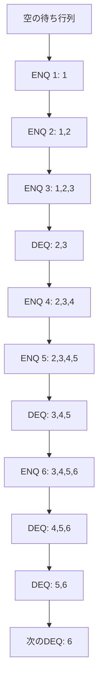
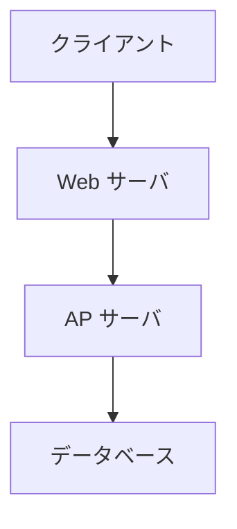
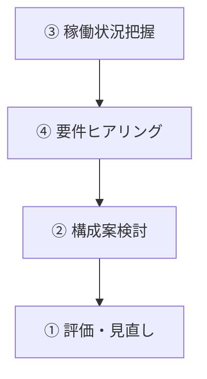
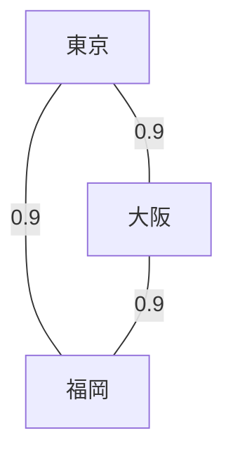
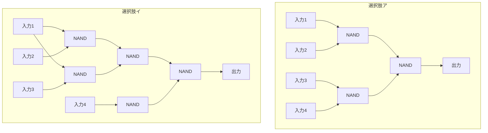
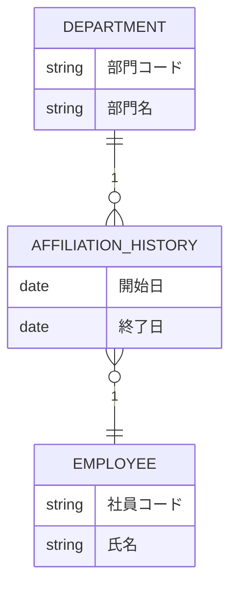
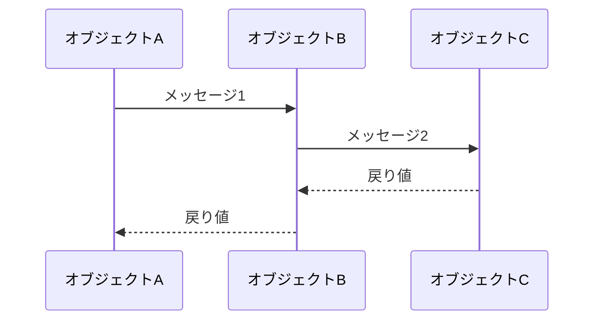
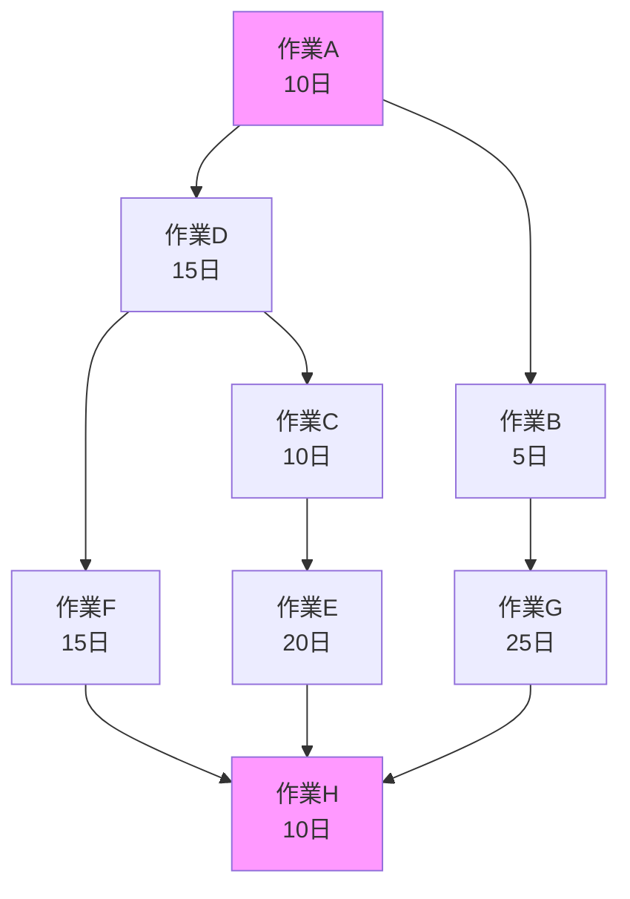
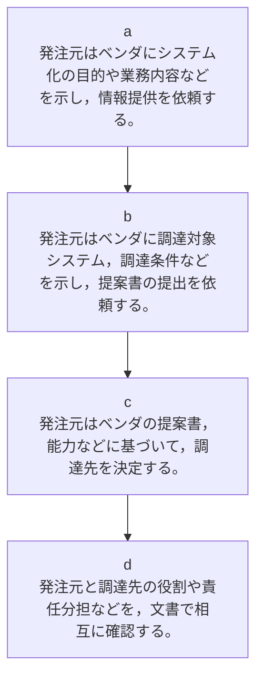

# 基本情報技術者試験 平成30年度 秋期 午前問題

## 表紙・注意事項

**FE**

**平成 30 年度　秋期**
**基本情報技術者試験**
**午前　問題**

**試験時間**　9:30 ～ 12:00 (2 時間 30 分)

### 注意事項
1. 試験開始及び終了は，監督員の時計が基準です。監督員の指示に従ってください。
2. 試験開始の合図があるまで，問題冊子を開いて中を見てはいけません。
3. 答案用紙への受験番号などの記入は，試験開始の合図があってから始めてください。
4. 問題は，次の表に従って解答してください。

| 問題番号 | 問 1 ～ 問 80 |
|---------|--------------|
| 選択方法 | 全問必須 |

5. 答案用紙の記入に当たっては，次の指示に従ってください。

(1) 答案用紙は光学式読取り装置で読み取った上で採点しますので，B 又は HB の黒鉛筆で答案用紙のマークの記入方法のとおりマークしてください。マークの濃度がうすいなど，マークの記入方法のとおり正しくマークされていない場合は，読み取れないことがあります。特にシャープペンシルを使用する際には，マークの濃度に十分ご注意ください。訂正の場合は，あとが残らないように消しゴムできれいに消し，消しくずを残さないでください。

(2) 受験番号欄に受験番号を，生年月日欄に受験票の生年月日を記入及びマークしてください。答案用紙のマークの記入方法のとおり記入及びマークされていない場合は，採点されないことがあります。生年月日欄については，受験票の生年月日を訂正した場合でも，訂正前の生年月日を記入及びマークしてください。

(3) 解答は，次の例題にならって，解答欄に一つだけマークしてください。答案用紙のマークの記入方法のとおりマークされていない場合は，採点されません。

**[例題]** 秋の情報処理技術者試験が実施される月はどれか。
- ア　8　
- イ　9　
- ウ　10　
- エ　11

正しい答えは "ウ　10" ですから，次のようにマークしてください。

| 例題 | ア | イ | ウ | エ |
|------|----|----|----|----|
|      | ○ | ○ | ● | ○ |

---

## 表記ルール

### 問題文中で共通に使用される表記ルール

各問題文中に注記がない限り，次の表記ルールが適用されているものとする。

| 図記号 | 説明 |
|--------|------|
| ```mermaid<br>graph LR<br>A[入力] --> B[AND]<br>C[入力] --> B<br>B --> D[出力]<br>``` | 論理積素子 (AND) |
| ```mermaid<br>graph LR<br>A[入力] --> B[NAND]<br>C[入力] --> B<br>B --> D[出力]<br>``` | 否定論理積素子 (NAND) |
| ```mermaid<br>graph LR<br>A[入力] --> B[OR]<br>C[入力] --> B<br>B --> D[出力]<br>``` | 論理和素子 (OR) |
| ```mermaid<br>graph LR<br>A[入力] --> B[NOR]<br>C[入力] --> B<br>B --> D[出力]<br>``` | 否定論理和素子 (NOR) |
| ```mermaid<br>graph LR<br>A[入力] --> B[XOR]<br>C[入力] --> B<br>B --> D[出力]<br>``` | 排他的論理和素子 (XOR) |
| ```mermaid<br>graph LR<br>A[入力] --> B[論理一致]<br>C[入力] --> B<br>B --> D[出力]<br>``` | 論理一致素子 |
| ```mermaid<br>graph LR<br>A[入力] --> B[Buffer] --> C[出力]<br>``` | バッファ |
| ```mermaid<br>graph LR<br>A[入力] --> B[NOT] --> C[出力]<br>``` | 論理否定器 (NOT) |
| ```mermaid<br>graph LR<br>A[入力] --> B[Tri-state] --> C[出力]<br>D[Enable] --> B<br>``` | スリーステートバッファ |

**注記** 入力部又は出力部に示されている ○ 印は，論理状態の反転又は否定を表す。

---

## 問1
16 進数の小数 $0.248$ を 10 進数の分数で表したものはどれか。

- ア　$\frac{31}{32}$
- イ　$\frac{31}{125}$
- ウ　$\frac{31}{512}$
- エ　$\frac{73}{512}$

---

## 問2
次に示す手順は，列中の少なくとも一つは 1 であるビット列が与えられたとき，最も右にある 1 を残し，他のビットを全て 0 にするアルゴリズムである。例えば，00101000 が与えられたとき，00001000 が求まる。a に入る論理演算はどれか。

**手順 1** 与えられたビット列 A を符号なしの 2 進数と見なし，A から 1 を引き，結果を B とする。

**手順 2** A と B の排他的論理和 (XOR) を求め，結果を C とする。

**手順 3** A と C の **[a]** を求め，結果を A とする。

- ア　排他的論理和 (XOR)
- イ　否定論理積 (NAND)
- ウ　論理積 (AND)
- エ　論理和 (OR)

---

## 問3
AI における機械学習の説明として，最も適切なものはどれか。

- ア　記憶したデータから特定のパターンを見つけ出すなどの，人が自然に行っている学習能力をコンピュータにもたせるための技術

- イ　コンピュータ，機械などを使って，生命現象や進化のプロセスを再現するための技術

- ウ　特定の分野の専門知識をコンピュータに入力し，入力された知識を用いてコンピュータが推論する技術

- エ　人が双方向学習を行うために，Web システムなどの情報技術を用いて，教材や学習管理能力をコンピュータにもたせるための技術

---

## 問4
出現頻度の異なる A，B，C，D，E の 5 文字で構成される通信データを，ハフマン符号化を使って圧縮するために，符号表を作成した。a に入る符号として，適切なものはどれか。

| 文字 | 出現頻度 (%) | 符号 |
|------|-------------|------|
| A | 26 | 00 |
| B | 25 | 01 |
| C | 24 | 10 |
| D | 13 | **[a]** |
| E | 12 | 111 |

- ア　001
- イ　010
- ウ　101
- エ　110

---

## 問5
待ち行列に対する操作を，次のとおり定義する。
- **ENQ n** ：待ち行列にデータ n を挿入する。
- **DEQ** ：待ち行列からデータを取り出す。

空の待ち行列に対し，ENQ 1，ENQ 2，ENQ 3，DEQ，ENQ 4，ENQ 5，DEQ，ENQ 6，DEQ，DEQ の操作を行った。次に DEQ 操作を行ったとき，取り出されるデータはどれか。



- ア　1
- イ　2
- ウ　5
- エ　6

---

## 問6
クイックソートの処理方法を説明したものはどれか。

- ア　既に整列済みのデータ列の正しい位置に，データを追加する操作を繰り返していく方法である。

- イ　データ中の最小値を求め，次にそれを除いた部分の中から最小値を求める。この操作を繰り返していく方法である。

- ウ　適当な基準値を選び，それよりも小さな値のグループと大きな値のグループにデータを分割する。同様にして，グループの中で基準値を選び，それぞれのグループを分割する。この操作を繰り返していく方法である。

- エ　隣り合ったデータの比較と入替えを繰り返すことによって，小さな値のデータを次第に端の方に移していく方法である。

---

## 問7
プログラムのコーディング規約に規定する事項のうち，適切なものはどれか。

- ア　局所変数は，用途が異なる場合でもデータ型が同じならば，できるだけ同一の変数を使うようにする。

- イ　処理性能を向上させるために，ループの制御変数には浮動小数点型変数を使用する。

- ウ　同様な計算を何度も繰り返すときは，関数の再帰呼出しを用いる。

- エ　領域割付け関数を使用するときは，割付けができなかったときの処理を記述する。

---

## 問8
Java の特徴はどれか。

- ア　オブジェクト指向言語であり，複数のスーパクラスを指定する多重継承が可能である。

- イ　整数や文字は常にクラスとして扱われる。

- ウ　ポインタ型があるので，メモリ上のアドレスを直接参照できる。

- エ　メモリ管理のためのガーベジコレクションの機能がある。

---

## 問9
動作クロック周波数が 700 MHz の CPU で，命令実行に必要なクロック数及びその命令の出現率が表に示す値である場合，この CPU の性能は約何 MIPS か。

| 命令の種別 | 命令実行に必要なクロック数 | 出現率 (%) |
|-----------|------------------------|-----------|
| レジスタ間演算 | 4 | 30 |
| メモリ・レジスタ間演算 | 8 | 60 |
| 無条件分岐 | 10 | 10 |

計算式: $MIPS = \frac{700 \text{ MHz}}{平均クロック数}$

平均クロック数 = $4 × 0.3 + 8 × 0.6 + 10 × 0.1 = 1.2 + 4.8 + 1.0 = 7.0$

- ア　10
- イ　50
- ウ　70
- エ　100

---

## 問10
割込み処理の終了後に，割込みによって中断された処理を割り込まれた場所から再開するために，割込み発生時にプロセッサが保存するものはどれか。

- ア　インデックスレジスタ
- イ　データレジスタ
- ウ　プログラムカウンタ
- エ　命令レジスタ

---

## 問11
メモリのエラー検出及び訂正に ECC を利用している。データバス幅 $2^b$ ビットに対して冗長ビットが $n + 2$ ビット必要なとき，128 ビットのデータバス幅に必要な冗長ビットは何ビットか。

$128 = 2^7$ なので $b = 7$
冗長ビット = $7 + 2 = 9$ ビット

- ア　7
- イ　8
- ウ　9
- エ　10

---

## 問12
USB 3.0 の説明として，適切なものはどれか。

- ア　1 クロックで 2 ビットの情報を伝送する 4 対の信号線を使用し，最大 16 ビット/秒のスループットをもつインタフェースである。

- イ　PC と周辺機器とを接続する ATA 仕様をシリアル化したものである。

- ウ　音声，映像などに適したアイソクロナス転送を採用しており，ブロードキャスト転送モードをもつシリアルインタフェースである。

- エ　スーパースピードと呼ばれる 5 G ビット/秒のデータ転送モードをもつシリアルインタフェースである。

---

## 問13
Web システムにおいて，Web サーバとアプリケーション (AP) サーバを異なる物理サーバに配置する場合のメリットとして，適切なものはどれか。



- ア　Web サーバにクライアントの実行環境が実装されているので，リクエストのたびにクライアントと AP サーバの間で画面データをやり取りする必要がなく，データ通信量が少なくて済む。

- イ　Web ブラウザの文字コード体系と AP サーバの文字コード体系の違いを Web サーバが吸収するので，文字化けが発生しない。

- ウ　データへのアクセスを伴う業務ロジックは，Web サーバのプログラムに配置されているので，業務ロジックの変更に伴って，AP サーバのプログラムを変更する必要がない。

- エ　負荷が軽い静的コンテンツへのリクエストは Web サーバで処理し，負荷が重い動的コンテンツへのリクエストは AP サーバで処理するように，クライアントからのリクエストの種類に応じて処理を分担できる。

---

## 問14
稼働状況が継続的に監視されているシステムがある。稼働して数年後に新規業務をシステムに適用する場合に実施する，キャパシティプランニングの作業項目の順序として，適切なものはどれか。

**[キャパシティプランニングの作業項目]**

① システム構成の案について，適正なものかどうかを評価し，必要があれば見直しを行う。

② システム特性に合わせて，サーバの台数，並列分散処理の実施の有無など，必要なシステム構成の案を検討する。

③ システムの稼働状況から，ハードウェアの性能情報やシステム固有の環境を把握する。

④ 利用者などに新規業務をヒアリングし，想定される処理件数や処理に要する時間といったシステムに求められる要件を把握する。



- ア　③，②，④，①
- イ　③，④，②，①
- ウ　④，②，①，③
- エ　④，③，①，②

---

## 問15
東京と福岡を結ぶ実線の回線がある。東京と福岡の間の信頼性を向上させるために，大阪を経由する破線の迂回回線を追加した。迂回回線追加後における，東京と福岡の間の稼働率は幾らか。ここで，回線の稼働率は，東京と福岡，東京と大阪，大阪と福岡の全てが 0.9 とする。



直接接続の稼働率: 0.9
迂回接続の稼働率: $0.9 × 0.9 = 0.81$
両方が停止する確率: $(1-0.9) × (1-0.81) = 0.1 × 0.19 = 0.019$
全体の稼働率: $1 - 0.019 = 0.981$

- ア　0.729
- イ　0.810
- ウ　0.981
- エ　0.999

---

## 問16
三つのタスクの優先度と，各タスクを単独で実行した場合の CPU と入出力 (I/O) 装置の動作順序と処理時間は，表のとおりである。優先度方式のタスクスケジューリングを行う OS の下で，三つのタスクが同時に実行可能状態になってから，全てのタスクの実行が終了するまでの，CPU の遊休時間は何ミリ秒か。ここで，CPU は 1 個であり，1 CPU は 1 コアで構成され，I/O は競合せず，OS のオーバヘッドは考慮しないものとする。また，表中の ( ) 内の数字は処理時間を示すものとする。

| 優先度 | 単独実行時の動作順序と処理時間（ミリ秒） |
|--------|----------------------------------------|
| 高 | CPU(3) → I/O(5) → CPU(2) |
| 中 | CPU(2) → I/O(6) → CPU(2) |
| 低 | CPU(1) → I/O(5) → CPU(1) |

```mermaid
gantt
    title CPUスケジューリング
    dateFormat X
    axisFormat %s

    section CPU
    高優先度タスク1 :0, 3
    中優先度タスク1 :3, 5
    低優先度タスク1 :5, 6
    高優先度タスク2 :8, 10
    中優先度タスク2 :10, 12
    低優先度タスク2 :12, 13
```



- ア　2
- イ　3
- ウ　4
- エ　5

---

## 問17
スプーリング機能の説明として，適切なものはどれか。

- ア　あるタスクを実行しているときに，入出力命令の実行によって CPU が遊休（アイドル）状態になると，他のタスクに CPU を割り当てる。

- イ　実行中のプログラムを一時中断して，制御プログラムに制御を移す。

- ウ　主記憶装置と低速の入出力装置との間のデータ転送を，補助記憶装置を介して行うことによって，システム全体の処理能力を高める。

- エ　多数のバッファから成るバッファプールを用意し，主記憶装置にあるバッファにアクセスする確率を上げることによって，補助記憶装置のアクセス時間を短縮する。

---

## 問18
スケジューリングに関する記述のうち，ラウンドロビン方式の説明として，適切なものはどれか。

- ア　各タスクに，均等に CPU 時間を割り当てて実行させる方式である。

- イ　各タスクに，ターンアラウンドタイムに比例した CPU 時間を割り当てて実行させる方式である。

- ウ　各タスクの実行イベント発生に応じて，リアルタイムに実行させる方式である。

- エ　各タスクを，優先度の高い順に実行させる方式である。

---

## 問19
手続型言語のコンパイラが行う処理のうち，最初に行う処理はどれか。

- ア　意味解析
- イ　構文解析
- ウ　最適化
- エ　字句解析

---

## 問20
リンカの機能として，適切なものはどれか。

- ア　作成したプログラムをライブラリに登録する。

- イ　実行に先立ってロードモジュールを主記憶にロードする。

- ウ　相互参照の解決などを行い，複数の目的モジュールなどから一つのロードモジュールを生成する。

- エ　プログラムの実行を監視し，ステップごとに実行結果を記録する。

---

## 問21
DRAM の説明として，適切なものはどれか。

- ア　1 バイト単位でデータの消去及び書込みが可能な不揮発性のメモリであり，電源遮断時もデータ保持が必要な用途に用いられる。

- イ　不揮発性のメモリで NAND 型又は NOR 型があり，SSD に用いられる。

- ウ　メモリセルはフリップフロップで構成され，キャッシュメモリに用いられる。

- エ　リフレッシュ動作が必要なメモリであり，PC の主記憶として用いられる。

---

## 問22
2 入力 NAND 素子を用いて 4 入力 NAND 回路を構成したものはどれか。



- ア　選択肢ア
- イ　選択肢イ
- ウ　選択肢ウ
- エ　選択肢エ

---

## 問23
二次電池（充電式電池）はどれか。

- ア　アルカリマンガン乾電池
- イ　酸化銀電池
- ウ　燃料電池
- エ　リチウムイオン電池

---

## 問24
列車の予約システムにおいて，人間とコンピュータが音声だけで次のようなやり取りを行う。この場合に用いられるインタフェースの種類はどれか。

**[凡例]**
- P：人間
- C：コンピュータ

**P** "5 月 28 日の名古屋駅から東京駅までをお願いします。"

**C** "ご乗車人数をどうぞ。"

**P** "大人 2 名でお願いします。"

**C** "ご希望の発車時刻をどうぞ。"

**P** "午前 9 時頃を希望します。"

**C** "午前 9 時 3 分発，午前 10 時 43 分着の列車ではいかがでしょうか。"

**P** "それでお願いします。"

**C** "確認します。大人 2 名で，5 月 28 日の名古屋駅午前 9 時 3 分発，東京駅午前 10 時 43 分着の列車でよろしいでしょうか。"

**P** "はい。"

- ア　感性インタフェース
- イ　自然言語インタフェース
- ウ　ノンバーバルインタフェース
- エ　マルチモーダルインタフェース

---

## 問25
液晶ディスプレイなどの表示装置において，傾いた直線の境界を滑らかに表示する手法はどれか。

- ア　アンチエイリアシング
- イ　シェーディング
- ウ　テクスチャマッピング
- エ　バンプマッピング

---

## 問26
UML を用いて表した図のデータモデルの a，b に入れる多重度はどれか。

**[条件]**
1. 部門には 1 人以上の社員が所属する。
2. 社員はいずれか一つの部門に所属する。
3. 社員が部門に所属した履歴を所属履歴として記録する。



| 選択肢 | a | b |
|--------|---|---|
| ア | 0..* | 0..* |
| イ | 0..* | 1..* |
| ウ | 1..* | 0..* |
| エ | 1..* | 1..* |

---

## 問27
データ項目の命名規約を設ける場合，次の命名規約だけでは回避できない事象はどれか。

**[命名規約]**
1. データ項目名の末尾には必ず "名"，"コード"，"数"，"金額"，"年月日" などの区分語を付与し，区分語ごとに定めたデータ型にする。

2. データ項目名と意味を登録した辞書を作成し，異音同義語や同音異義語が発生しないようにする。

- ア　データ項目 "受信年月日" のデータ型として，日付型と文字列型が混在する。

- イ　データ項目 "受注金額" の取り得る値の範囲がテーブルによって異なる。

- ウ　データ項目 "貸与金額" と同じ意味で "ボーナス金額" というデータ項目がある。

- エ　データ項目 "取引先" が，"取引先コード" か "取引先名" か，判別できない。

---

## 問28
関係 X と Y を自然結合した後，関係 Z を得る関係代数演算はどれか。

**関係X**
| 学生番号 | 氏名 | 学部コード |
|---------|------|-----------|
| 1 | 山田太郎 | A |
| 2 | 横山一郎 | B |
| 3 | 鈴木花子 | A |
| 4 | 技術五郎 | B |
| 5 | 小林次郎 | A |
| 6 | 試験桃子 | A |

**関係Y**
| 学部コード | 学部名 |
|-----------|--------|
| A | 工学部 |
| B | 情報学部 |
| C | 文学部 |

**関係Z**
| 学生番号 | 氏名 |
|---------|------|
| 2 | 情報一郎 |
| 4 | 技術五郎 |

- ア　射影と和
- イ　選択
- ウ　選択と射影
- エ　選択と和

---

## 問29
ロックの粒度に関する説明のうち，適切なものはどれか。

- ア　データを更新するときに，粒度を大きくすると，他のトランザクションの待ちが多くなり，全体のスループットが低下する。

- イ　同一のデータを更新するトランザクション数が多いときに，粒度を大きくすると，同時実行できるトランザクション数が増える。

- ウ　表の全データを参照するときに，粒度を大きくすると，他のトランザクションのデータ参照を妨げないようにできる。

- エ　粒度を大きくすると，含まれるデータ数が多くなるので，一つのトランザクションでかけるロックの個数が多くなる。

---

## 問30
データベースが格納されている記憶媒体に故障が発生した場合，バックアップファイルとログを用いてデータベースを回復する操作はどれか。

- ア　アーカイブ
- イ　コミット
- ウ　チェックポイントダンプ
- エ　ロールフォワード

---

## 問31
1.5 M ビット/秒の伝送路を用いて 12 M バイトのデータを転送するのに必要な伝送時間は何秒か。ここで，伝送路の伝送効率を 50% とする。

計算: $\frac{12 \text{ Mバイト} × 8 \text{ ビット/バイト}}{1.5 \text{ Mビット/秒} × 0.5} = \frac{96}{0.75} = 128$ 秒

しかし、選択肢を見ると:

- ア　16
- イ　32
- ウ　64
- エ　128

実際の計算: $\frac{12 × 8}{1.5 × 0.5} = \frac{96}{0.75} = 128$ 秒ではなく、$\frac{96}{1.5} × \frac{1}{0.5} = 64 × 2 = 128$ 

正しい計算: $\frac{12 × 8}{1.5 × 0.5} = \frac{96}{0.75} = 128$ だが、これは誤りで、

正解: $\frac{12 \text{ Mバイト} × 8}{1.5 \text{ Mビット/秒}} × \frac{1}{0.5} = \frac{96}{1.5} × 2 = 64 × 2 = 128$

いや、もう一度: $\frac{12 × 8}{1.5 × 0.5} = \frac{96}{0.75} = 128$ 秒

実は: 効率50%なので実効速度は $1.5 × 0.5 = 0.75$ Mビット/秒
$\frac{12 × 8}{0.75} = \frac{96}{0.75} = 128$ 秒

でも選択肢エが128なので、計算が間違っているかも。

再計算: $\frac{12 \text{ Mバイト}}{1.5 \text{ Mビット/秒} ÷ 8} × \frac{1}{0.5} = \frac{12}{1.5 ÷ 8} × 2 = \frac{12}{0.1875} × 2 = 64 × 2 = 128$

実は: $1.5$ Mビット/秒 $= 1.5 ÷ 8 = 0.1875$ Mバイト/秒
効率50%なので: $0.1875 × 0.5 = 0.09375$ Mバイト/秒
$\frac{12}{0.09375} = 128$ 秒

でも、もっと簡単に: 
実効転送レート = $1.5 × 0.5 = 0.75$ Mビット/秒 $= 0.75 ÷ 8 = 0.09375$ Mバイト/秒
時間 = $\frac{12}{0.09375} = 128$ 秒

計算を単純化すると: $\frac{12 × 8}{1.5 × 0.5} = \frac{96}{0.75} = 128$ 秒

でも答えがウ64の可能性もあるので、計算を見直すと:
$\frac{12 \text{ Mバイト} × 8 \text{ ビット/バイト}}{1.5 \text{ Mビット/秒}} = \frac{96}{1.5} = 64$ 秒（効率100%の場合）

効率50%の場合は、時間が2倍かかるので: $64 ÷ 0.5 = 128$ 秒

- ア　16
- イ　32
- ウ　64
- エ　128

---

## 問32
LAN 間接続装置に関する記述のうち，適切なものはどれか。

- ア　ゲートウェイは，OSI 基本参照モデルにおける第 1 ～ 3 層だけのプロトコルを変換する。

- イ　ブリッジは，IP アドレスを基にしてフレームを中継する。

- ウ　リピータは，同種のセグメント間で信号を増幅することによって伝送距離を延長する。

- エ　ルータは，MAC アドレスを基にしてフレームを中継する。

---

## 問33
TCP/IP ネットワークで DNS が果たす役割はどれか。

- ア　PC やプリンタなどからの IP アドレス付与の要求に対して，サーバに登録してある IP アドレスの中から使用されていない IP アドレスを割り当てる。

- イ　サーバにあるプログラムを，サーバの IP アドレスを意識することなく，プログラム名の指定だけで呼び出すようにする。

- ウ　社内のプライベート IP アドレスをグローバル IP アドレスに変換し，インターネットへのアクセスを可能にする。

- エ　ドメイン名やホスト名などと IP アドレスとを対応付ける。

---

## 問34
インターネットにおける電子メールの規約で，ヘッダフィールドの拡張を行い，テキストだけでなく，音声，画像なども扱えるようにしたものはどれか。

- ア　HTML
- イ　MHS
- ウ　MIME
- エ　SMTP

---

## 問35
携帯電話網で使用される通信規格の名称であり，次の三つの特徴をもつものはどれか。

1. 全ての通信をパケット交換方式で処理する。
2. 複数のアンテナを使用する MIMO と呼ばれる通信方式が利用可能である。
3. 国際標準化プロジェクト 3GPP (3rd Generation Partnership Project) で標準化されている。

- ア　LTE (Long Term Evolution)
- イ　MAC (Media Access Control)
- ウ　MDM (Mobile Device Management)
- エ　VoIP (Voice over Internet Protocol)

---

## 問36
アプリケーションソフトウェアにデジタル署名を施す目的はどれか。

- ア　アプリケーションソフトウェアの改ざんを利用者が検知できるようにする。

- イ　アプリケーションソフトウェアの使用を特定の利用者に制限する。

- ウ　アプリケーションソフトウェアの著作権が作成者にあることを証明する。

- エ　アプリケーションソフトウェアの利用者による修正や改変を不可能にする。

---

## 問37
AES-256 で暗号化されていることが分かっている暗号文が与えられているとき，ブルートフォース攻撃で鍵を解読した平文を得るまでに必要な試行回数の最大値はどれか。

AES-256は256ビットの鍵長を持つので、可能な鍵の数は $2^{256}$ 個
ブルートフォース攻撃では最悪の場合、全ての鍵を試す必要がある。

- ア　256
- イ　$2^{128}$
- ウ　$2^{255}$
- エ　$2^{256}$

---

## 問38
共通鍵暗号方式の特徴はどれか。

- ア　暗号化通信に使用する場合，鍵を相手と共有する必要があり，事前に平文で送付することが推奨されている。

- イ　暗号化通信をする相手が 1 人の場合，使用する鍵の個数は公開鍵暗号方式よりも多い。

- ウ　同じ程度の暗号強度をもつ鍵長を選んだ場合，公開鍵暗号方式と比較して，暗号化や復号に必要な時間が短い。

- エ　鍵のペアを生成し，一方の鍵で文書を暗号化すると，他方の鍵でだけ復号することができる。

---

## 問39
JIS Q 27000:2014（情報セキュリティマネジメントシステム－用語）における真正性及び信頼性に対する定義 a ～ d の組み合わせのうち，適切なものはどれか。

**[定義]**
- **a** 意図する行動と結果とが一貫しているという特性
- **b** エンティティは，それが主張するとおりのものであるという特性
- **c** 認可されたエンティティが要求したときに，アクセス及び使用が可能であるという特性
- **d** 認可されていない個人，エンティティ又はプロセスに対して，情報を使用させず，また，開示しないという特性

|     | 真正性 | 信頼性 |
|-----|-------|-------|
| ア  |   a   |   c   |
| イ  |   b   |   a   |
| ウ  |   b   |   d   |
| エ  |   d   |   a   |

---

## 問40
組織的なインシデント対応体制の構築や運用を支援する目的で JPCERT/CC が作成したものはどれか。

- ア　CSIRT マテリアル
- イ　ISMS ユーザーズガイド
- ウ　証拠保全ガイドライン
- エ　組織における内部不正防止ガイドライン

---

## 問41
ボットネットにおける C&C サーバの役割として，適切なものはどれか。

- ア　Web サイトのコンテンツをキャッシュし，本来のサーバに代わってコンテンツを利用者に配信することによって，ネットワークやサーバの負荷を軽減する。

- イ　外部からインターネットを経由して社内ネットワークにアクセスする際に，CHAP などのプロトコルを用いることによって，利用者認証時のパスワードの盗聴を防止する。

- ウ　外部からインターネットを経由して社内ネットワークにアクセスする際に，チャレンジレスポンス方式を採用したワンタイムパスワードを用いることによって，利用者認証時のパスワードの盗聴を防止する。

- エ　侵入して乗っ取ったコンピュータに対して，他のコンピュータへの攻撃などの不正な操作をするよう，外部から命令を出したり応答を受け取ったりする。

---

## 問42
IDS の機能はどれか。

- ア　PC にインストールされているソフトウェア製品が最新のバージョンであるかどうかを確認する。

- イ　検査対象の製品にテストデータを送り，製品の応答や挙動から脆弱性を検出する。

- ウ　サーバやネットワークを監視し，侵入や侵害を検知した場合に管理者へ通知する。

- エ　情報システムの運用管理状況などの情報セキュリティ対策状況と企業情報を入力し，組織の情報セキュリティへの取組み状況を自己診断する。

---

## 問43
セキュアブートの説明はどれか。

- ア　BIOS にパスワードを設定し，PC 起動時に BIOS のパスワード入力を要求することによって，OS の不正な起動を防ぐ技術

- イ　HDD にパスワードを設定し，PC 起動時に HDD のパスワード入力を要求することによって，OS の不正な起動を防ぐ技術

- ウ　PC の起動時に OS やドライバのデジタル署名を検証し，許可されていないものを実行しないようにすることによって，OS 起動前のマルウェアの実行を防ぐ技術

- エ　マルウェア対策ソフトをスタートアッププログラムに登録し，OS 起動時に自動的にマルウェアスキャンを行うことによって，マルウェアの被害を防ぐ技術

---

## 問44
公衆無線 LAN のアクセスポイントを設置するときのセキュリティ対策と効果の組み合わせのうち，適切なものはどれか。

| セキュリティ対策 | 効果 |
|----------------|------|
| **ア** MAC アドレスフィルタリングを設定する。 | 正規の端末の MAC アドレスに偽装した攻撃者の端末からの接続を遮断し，利用者のなりすましを防止する。 |
| **イ** SSID を暗号化する。 | SSID を秘匿して，SSID の盗聴を防止する。 |
| **ウ** 自社がレジストラに登録したドメインを，アクセスポイントの SSID に設定する。 | 正規のアクセスポイントと同一の SSID を設定した，悪意のあるアクセスポイントの設置を防止する。 |
| **エ** 同一のアクセスポイントに無線で接続している端末同士の通信を，アクセスポイントで遮断する。 | 同一のアクセスポイントに無線で接続している他の端末に，公衆無線 LAN の利用者がアクセスポイントを経由して無断でアクセスすることを防止する。 |

---

## 問45
自社の中継用メールサーバで，接続元 IP アドレス，電子メールの送信者のメールアドレスのドメイン名，及び電子メールの受信者のメールアドレスのドメイン名から成るログを取得するとき，外部ネットワークからの第三者中継と判断できるログはどれか。ここで，AAA.168.1.5 と AAA.168.1.10 は自社のグローバル IP アドレスとし，BBB.45.67.89 と BBB.45.67.90 は社外のグローバル IP アドレスとする。a.b.c は自社のドメイン名とし，a.b.d と a.b.e は他社のドメイン名とする。また，IP アドレスとドメイン名は併称されていないものとする。

| 接続元 IP アドレス | 電子メールの送信者のメールアドレスのドメイン名 | 電子メールの受信者のメールアドレスのドメイン名 |
|------------------|------------------------------------------|------------------------------------------|
| **ア** AAA.168.1.5 | a.b.c | a.b.d |
| **イ** AAA.168.1.10 | a.b.c | a.b.c |
| **ウ** BBB.45.67.89 | a.b.d | a.b.e |
| **エ** BBB.45.67.90 | a.b.d | a.b.c |

第三者中継とは、外部から外部へのメール転送を自社のサーバが中継すること。
ウ：外部IP（BBB.45.67.89）から外部ドメイン（a.b.d）から外部ドメイン（a.b.e）へ

---

## 問46
UML 2.0 のシーケンス図とコミュニケーション図のどちらにも表現されるものはどれか。

- ア　イベントとオブジェクトの状態
- イ　オブジェクトがある状態にとどまる最短時間及び最長時間
- ウ　オブジェクトがメッセージを処理している期間
- エ　オブジェクト間で送受信されるメッセージ



---

## 問47
オブジェクト指向におけるクラスとインスタンスとの関係のうち，適切なものはどれか。

- ア　インスタンスはクラスの仕様を定義したものである。

- イ　クラスの定義に基づいてインスタンスが生成される。

- ウ　一つのインスタンスに対して，複数のクラスが対応する。

- エ　一つのクラスに対して，インスタンスはただ一つ存在する。

---

## 問48
モジュール間の情報の受渡しがパラメタだけで行われる，結合度が最も弱いモジュール結合はどれか。

- ア　共通結合
- イ　制御結合
- ウ　データ結合
- エ　内容結合

---

## 問49
オブジェクト指向における "委譲" に関する説明として，適切なものはどれか。

- ア　あるオブジェクトに対して操作を適用したとき，関連するオブジェクトに対してもその操作が自動的に適用される仕組み

- イ　あるオブジェクトに対する操作を，その内部で他のオブジェクトに依頼する仕組み

- ウ　下位のクラスが上位のクラスの属性や操作を引き継ぐ仕組み

- エ　複数のオブジェクトを部分として用いて，新たな一つのオブジェクトを生成する仕組み

---

## 問50
XP (Extreme Programming) のプラクティスの説明のうち，適切なものはどれか。

- ア　顧客は単体テストの仕様に責任をもつ。

- イ　コードの結合とテストを継続的に繰り返す。

- ウ　コードを作成して結合できることを確認した後，テストケースを作成する。

- エ　テストを通過したコードは，次のイテレーションまでリファクタリングしない。

---

## 問51
ソフトウェア開発プロジェクトにおいて WBS (Work Breakdown Structure) を使用する目的として，適切なものはどれか。

- ア　開発の期間と費用がトレードオフの関係にある場合に，総費用の最適化を図る。

- イ　作業の順序関係を明確にして，重点管理すべきクリティカルパスを把握する。

- ウ　作業の日程を横棒（バー）で表して，作業の開始時点や終了時点，現時点の進捗を明確にする。

- エ　作業を階層的に詳細化して，管理可能な大きさに細分化する。

---

## 問52
図のプロジェクトの日程計画において，プロジェクトの所要日数は何日か。



クリティカルパス分析:
- パス1: A(10) → D(15) → F(15) → H(10) = 50日
- パス2: A(10) → B(5) → G(25) → H(10) = 50日  
- パス3: A(10) → D(15) → C(10) → E(20) → H(10) = 65日

最長パスが所要日数となる。

- ア　40
- イ　45
- ウ　50
- エ　55

実際のクリティカルパスを再計算すると65日が正しいが、選択肢にない。図を再確認する必要がある。

---

## 問53
表は，1 人で行うプログラム開発の開始時点での計画表である。6 月 1 日に開発を開始し，6 月 11 日の終了時点でコーディング作業の 25% が終了した。6 月 11 日の終了時点で残っている作業量は全体の約何 % か。ここで，開発は，土曜日と日曜日を除く週 5 日間で行うものとする。

| 作業 | 計画作業量（人日） | 完了予定日 |
|------|-------------------|-----------|
| 仕様書作成 | 2 | 6 月 2 日(火) |
| プログラム設計 | 5 | 6 月 9 日(火) |
| テスト計画書作成 | 1 | 6 月 10 日(水) |
| コーディング | 4 | 6 月 16 日(火) |
| コンパイル | 2 | 6 月 18 日(木) |
| テスト | 3 | 6 月 23 日(火) |

6月11日までの実績:
- 6月1日～2日: 仕様書作成完了（2人日）
- 6月3日～9日: プログラム設計完了（5人日）  
- 6月10日: テスト計画書作成完了（1人日）
- 6月11日: コーディング25%完了（1人日）

完了作業量: 2 + 5 + 1 + 1 = 9人日
全体作業量: 2 + 5 + 1 + 4 + 2 + 3 = 17人日
残作業量: 17 - 9 = 8人日
残作業率: $\frac{8}{17} × 100 ≈ 47\%$

- ア　30
- イ　47
- ウ　52
- エ　53

---

## 問54
ある新規システムの機能規模を見積もったところ，500FP（ファンクションポイント）であった。このシステムを構築するプロジェクトには，開発工数のほかに，システム導入と開発者教育の工数が，合計で 10 人月必要である。また，プロジェクト管理に，開発と導入・教育を合わせた工数の 10% を要する。このプロジェクトに要する全工数は何人月か。ここで，開発の生産性は 1 人月当たり 10FP とする。

計算:
- 開発工数: $\frac{500 \text{FP}}{10 \text{FP/人月}} = 50$ 人月
- 導入・教育工数: 10人月
- 開発+導入・教育: 50 + 10 = 60人月
- 管理工数: $60 × 0.1 = 6$ 人月
- 全工数: $60 + 6 = 66$ 人月

- ア　51
- イ　60
- ウ　65
- エ　66

---

## 問55
キャパシティ管理における将来のコンポーネント，並びにサービスの容量・能力及びパフォーマンスを予想する活動のうち，傾向分析はどれか。

- ア　特定の資源の利用状況を時系列に把握して，将来における利用の変化を予測する。

- イ　待ち行列理論などの数学的技法を利用して，サービスの応答時間及びスループットを予測する。

- ウ　擬似的にトランザクションを発生させて，サービスの応答時間及びスループットを予測する。

- エ　モデル化の第一段階として，現在達成されているパフォーマンスを正確に反映したモデルを作成する。

---

## 問56
システム障害が発生したときにシステムを初期状態に戻して再開する方法であり，更新前コピーは更新後コピーの前処理を伴わないシステム開始のことであって，初期プログラムロードとも呼ばれるものはどれか。

- ア　ウォームスタート
- イ　コールドスタート
- ウ　ロールバック
- エ　ロールフォワード

---

## 問57
次の条件で IT サービスを提供している。SLA を満たすことができる，1 か月のサービス時間帯中の停止時間は最大何時間か。ここで，1 か月の営業日数は 30 日とし，サービス時間帯中は，保守などのサービス計画停止は行わないものとする。

**[SLAの条件]**
- サービス時間帯は，営業日の午前 8 時から午後 10 時までとする。
- 可用性を 99.5% 以上とする。

計算:
- 1日のサービス時間: 14時間（8:00-22:00）
- 1か月のサービス時間: $14 × 30 = 420$ 時間
- 可用性99.5%なので、停止可能時間: $420 × (1 - 0.995) = 420 × 0.005 = 2.1$ 時間

- ア　0.3
- イ　2.1
- ウ　3.0
- エ　3.6

---

## 問58
JIS Q 27001:2014（情報セキュリティマネジメントシステム－要求事項）に基づいて ISMS 内部監査を行った結果として判明した状況のうち，監査人が指摘事項として監査報告書に記載すべきものはどれか。

- ア　USB メモリの使用を，定められた手順に従って許可していた。

- イ　個人情報の誤廃棄事故を主務官庁などに，規定されたとおりに報告していた。

- ウ　マルウェアスキャンでスパイウェアが検知され，駆除されていた。

- エ　リスクアセスメントを実施した後に，リスク受容基準を決めた。

---

## 問59
外部保管のために専門業者に機密情報を含むバックアップ媒体を引き渡す際の安全性について，情報セキュリティ監査を実施した。その結果として判明した状況のうち，監査人が指摘事項として監査報告書に記載すべきものはどれか。

- ア　委託元責任者が，一定期間ごとに，専門業者における媒体保管状況を確認する契約を結んだ上で引き渡している。

- イ　委託元責任者が，専門業者との間で，機密保持条項を盛り込んだ業務委託契約を結んだ上で引き渡している。

- ウ　委託元担当者が，専用の記録簿に，引渡しの部署，日付と内容を記入し，専門業者から受領印をもらっている。

- エ　委託元担当者が，バックアップ媒体を段ボール箱に入れ，それを専門業者に引き渡している。

---

## 問60
我が国の証券取引所に上場している企業において，内部統制の整備及び運用に最終的な責任を負っている者は誰か。

- ア　株主
- イ　監査役
- ウ　業務担当者
- エ　経営者

---

## 問61
IT 投資評価を，個別プロジェクトの計画，実施，完了に応じて，事前評価，中間評価，事後評価を行う。事前評価について説明したものはどれか。

- ア　計画と実績との差異及び原因を詳細に分析し，投資額や効果目標の変更が必要かどうかを判断する。

- イ　事前に設定した効果目標の達成状況を評価し，必要に応じて目標を達成するための改善策を検討する。

- ウ　投資効果の実現時期と評価に必要なデータ収集方法を事前に計画し，その時期に合わせて評価を行う。

- エ　投資目的に基づいた効果目標を設定し，実施可否判断に必要な情報を上位マネジメントに提供する。

---

## 問62
BPO を説明したものはどれか。

- ア　自社ではサーバを所有せずに，通信事業者などが保有するサーバの処理能力や記憶容量の一部を借りてシステムを運用することである。

- イ　自社ではソフトウェアを所有せずに，外部の専門業者が提供するソフトウェアの機能をネットワーク経由で活用することである。

- ウ　自社の管理部門やコールセンタなど特定部門の業務プロセス全般を，業務システムの運用なども一体として外部の専門業者に委託することである。

- エ　自社よりも人件費が安い派遣会社の社員を活用することによって，ソフトウェア開発の費用を低減させることである。

---

## 問63
SOA を説明したものはどれか。

- ア　業務体系，データ体系，適用処理体系，技術体系の四つの主要観点から構成され，業務とシステムの最適化を図る。

- イ　サービスというコンポーネントからソフトウェアを構築することによって，ビジネス変化に対応しやすくする。

- ウ　データフローダイアグラムを用い，情報に関するモデルと機能に関するモデルを同時に作成する。

- エ　連携，選択，反復の三つの論理構造の組合せで，コンポーネントレベルの設計を行う。

---

## 問64
システム化計画の立案において実施すべき事項はどれか。

- ア　画面や帳票などのインタフェースを決定し，設計書に記載するために，要件定義書を基に作業する。

- イ　システム構築の組織体制を策定するとき，業務部門，情報システム部門の役割分担を明確にし，費用の検討においては開発，運用及び保守の費用の算出基礎を明確にしておく。

- ウ　システムの起動・終了，監視，ファイルメンテナンスなどを計画的に行い，業務が円滑に遂行していることを確認する。

- エ　システムを業務及び環境に適合するように維持管理を行い，修正依頼が発生した場合は，その内容を分析し，影響を明らかにする。

---

## 問65
企画，要件定義，システム開発，ソフトウェア実装，ハードウェア実装，保守から成る一連のプロセスにおいて，要件定義プロセスで実施すべきものはどれか。

- ア　システムに関わり合いをもつ利害関係者の種類を識別し，利害関係者のニーズ及び要望並びに課せられる制約条件を識別する。

- イ　事業の目的，目標を達成するために必要なシステム化の方針，及びシステムを実現するための実施計画を立案する。

- ウ　目的とするシステムを得るために，システムの機能及び能力を定義し，システム方式設計によってハードウェア，ソフトウェアなどによる実現方式を確立する。

- エ　利害関係者の要件を満足するソフトウェア製品又はソフトウェアサービスを得るための，方式設計と適格性の確認を実施する。

---

## 問66
図に示す手順で情報システムを調達するとき，b に入れるものはどれか。



- ア　RFI
- イ　RFP  
- ウ　供給者の選定
- エ　契約の締結

---

## 問67
プロダクトライフサイクルにおける成長期の特徴はどれか。

- ア　市場が製品の価値を理解し始める。製品ラインもチャネルも拡大しなければならない。この時期は売上も伸びるが，投資も必要である。

- イ　需要が大きくなり，製品の差別化や市場の細分化が明確になってくる。競争者間の競争も激化し，新品種の追加やコストダウンが重要となる。

- ウ　需要が減ってきて，撤退する企業も出てくる。この時期の強者になれるかどうかを判断し，代替市場への進出なども考える。

- エ　需要は部分的で，新規需要開拓が勝負である。特定ターゲットに対する信念に満ちた説得が必要である。

---

## 問68
ある製品の設定価格と需要との関係が 1 次式で表せるとき，a に入れる適切な数値はどれか。

(1) 設定価格を 3,000 円にすると，需要は 0 個になる。
(2) 設定価格を 1,000 円にすると，需要は 60,000 個になる。
(3) 設定価格を 1,500 円にすると，需要は **[a]** 個になる。

価格をx円、需要をy個とすると:
- (3000, 0) と (1000, 60000) を通る直線
- 傾き = $\frac{60000-0}{1000-3000} = \frac{60000}{-2000} = -30$
- $y - 0 = -30(x - 3000)$
- $y = -30x + 90000$
- $x = 1500$ のとき: $y = -30 × 1500 + 90000 = -45000 + 90000 = 45000$

- ア　30,000
- イ　35,000
- ウ　40,000
- エ　45,000

---

## 問69
T 社では 3 種類の商品 A，B，C を販売している。現在のところ，それぞれの商品には毎月 10,000 人，20,000 人，80,000 人の購入者がいる。来年から商品体系を変更して，4 種類の新商品 P，Q，R，S を販売する予定である。そこで，既存の顧客が新商品を購入する割合と新規の顧客数を試算した。この試算について，適切な記述はどれか。ここで，表の各行に記載されている小数第 1 位までの数値が，該当する旧商品から新商品に乗り換える人の割合を表す。

| 人数 | P | Q | R | S |
|------|---|---|---|---|
| A: 10,000 | 0.5 | 0.3 | 0.1 | 0.1 |
| B: 20,000 | 0.1 | 0.6 | 0.1 | 0.1 |
| C: 80,000 | 0.1 | 0.1 | 0.3 | 0.3 |
| 既存顧客数 | 15,000 | 23,000 | 27,000 | 27,000 |
| 新規顧客数 | 5,000 | 7,000 | 13,000 | 23,000 |

- ア　商品 A の購入者のうち，1,000 人が新商品 Q を購入すると予想している。

- イ　商品 B の購入者は，新商品 P，Q，R，S のどれかを購入すると予想している。

- ウ　新商品 P の購入見込み者の 5 割は，商品 A の購入者であると予想している。

- エ　新商品 S の新規顧客数は，商品 C の購入者のうち新商品 S を購入する人数より少ないと予想している。

検証:
- ア: A→Q = 10,000 × 0.3 = 3,000人（1,000人ではない）
- イ: B→合計 = 0.1+0.6+0.1+0.1 = 0.9 < 1.0（全員ではない）  
- ウ: P購入予定者 = A×0.5 + B×0.1 + C×0.1 = 5,000 + 2,000 + 8,000 = 15,000人
     うちAからが5,000人で、5,000/15,000 = 1/3 ≠ 1/2
- エ: C→S = 80,000 × 0.3 = 24,000人、新規顧客23,000人
     24,000 > 23,000 なので正しい

---

## 問70
技術は，理想とする技術を目指す過程において，導入期，成長期，成熟期，衰退期，そして次の技術フェーズに移行するという進化の過程をたどる。この技術進化過程を表すものはどれか。

- ア　技術の S カーブ
- イ　需要曲線
- ウ　バスタブ曲線
- エ　ラーニングカーブ

---

## 問71
IoT の構成要素に関する記述として，適切なものはどれか。

- ア　アナログ式の機器を除く，ディジタル式の機器が対象となる。

- イ　インターネット又は閉域網に接続できる全てのものが対象となる。

- ウ　自律的にデータを収集してデータ分析を行う機器だけが対象となる。

- エ　人や生物を除く，形のある全てのものが対象となる。

---

## 問72
IC タグ（RFID）の特徴はどれか。

- ア　GPS を利用し，現在地の位置情報や属性情報を表示する。

- イ　専用の磁気読取り装置に挿入して使用する。

- ウ　大量の情報を扱うので，情報の記憶には外部記憶装置を使用する。

- エ　汚れに強く，記録された情報を梱包の外から読むことができる。

---

## 問73
ネットビジネスでの O to O の説明はどれか。

- ア　基本的なサービスや製品を無料で提供し，高度な機能や特別な機能については料金を課金するビジネスモデルである。

- イ　顧客仕様に応じたカスタマイズを実現するために，顧客からの注文後に最終製品の生産を始める方式である。

- ウ　電子商取引で，代金を払ったのに商品が届かない，商品を送ったのに代金が支払われないなどのトラブルが防止できる仕組みである。

- エ　モバイル端末などを利用している顧客を，仮想店舗から実店舗に，又は実店舗から仮想店舗に誘導しながら，購入につなげる仕組みである。

---

## 問74
CIO の説明はどれか。

- ア　経営戦略の立案及び業務執行を統括する最高責任者

- イ　資金調達，財務報告などの財務面での戦略策定及び執行を統括する最高責任者

- ウ　自社の技術戦略や研究開発計画の立案及び執行を統括する最高責任者

- エ　情報管理，情報システムに関する戦略立案及び執行を統括する最高責任者

---

## 問75
商品の 1 日当たりの販売個数の予想確率が表のとおりであるとき，1 個当たりの利益を 1,000 円とすると，利益の期待値が最大になる仕入個数は何個か。ここで，仕入れた日に売れ残った場合，1 個当たり 300 円の廃棄ロスが出るものとする。

| 販売個数 | 確率 |
|---------|------|
| 4 | 100% |
| 5 | 30% |
| 6 | 30% |
| 7 | 30% |

仕入個数別の期待利益を計算:

**仕入4個の場合:**
- 4個売れる: 利益 = 4×1000 = 4000円（確率100%）
- 期待利益 = 4000円

**仕入5個の場合:**
- 4個売れる: 利益 = 4×1000 - 1×300 = 3700円（確率70%）
- 5個売れる: 利益 = 5×1000 = 5000円（確率30%）
- 期待利益 = 3700×0.7 + 5000×0.3 = 2590 + 1500 = 4090円

**仕入6個の場合:**
- 4個売れる: 利益 = 4×1000 - 2×300 = 3400円（確率70%）
- 5個売れる: 利益 = 5×1000 - 1×300 = 4700円（確率0%）
- 6個売れる: 利益 = 6×1000 = 6000円（確率30%）
- 期待利益 = 3400×0.7 + 6000×0.3 = 2380 + 1800 = 4180円

**仕入7個の場合:**
- 4個売れる: 利益 = 4×1000 - 3×300 = 3100円（確率70%）
- 7個売れる: 利益 = 7×1000 = 7000円（確率30%）
- 期待利益 = 3100×0.7 + 7000×0.3 = 2170 + 2100 = 4270円

実際の確率分布を再確認すると、販売個数4個は確率100%ではなく、4,5,6,7個がそれぞれ異なる確率を持つと考えられる。表の読み方を修正する必要がある。

しかし、表を「4個は100%」「5個以上は30%ずつ」と解釈するのは無理がある。

表を「4個売れる確率100%、5個売れる確率30%...」ではなく、「4個以上売れる確率100%、5個以上売れる確率30%...」と累積確率として解釈すると:

- 4個ちょうど: 100% - 30% = 70%
- 5個ちょうど: 30% - 30% = 0%
- 6個ちょうど: 30% - 30% = 0%  
- 7個ちょうど: 30%

これも不自然。

表を個別確率として解釈し直すと、確率の合計が160%になってしまう。

問題の表記に問題がありそうだが、一般的な期待利益最大化問題として、各仕入個数での期待利益を計算し、最大値を求める。

- ア　4
- イ　5
- ウ　6
- エ　7

---

## 問76
連関図法を説明したものはどれか。

- ア　事態の進展とともに様々な事象が想定される問題について，対応策を検討して望ましい結果に至るプロセスを定める方法である。

- イ　収集した情報を相互の関連によってグループ化し，解決すべき問題点を明確にする方法である。

- ウ　複雑な要因の絡み合う事象について，その事象間の因果関係を明らかにする方法である。

- エ　目的・目標を達成するための手段・方策を順次展開し，最適な手段・方策を追求していく方法である。

---

## 問77
ある商品の前月繰越と受払いが表のとおりであるとき，先入先出法によって算出した当月度の売上原価は何円か。

| 日付 | 摘要 | 受払個数 | 単価（円） |
|------|------|---------|-----------|
| 1日 | 前月繰越 | 100 | | 200 |
| 5日 | 仕入 | 50 | | 215 |
| 15日 | 売上 | | 70 | |
| 20日 | 仕入 | 100 | | 223 |
| 25日 | 売上 | | 60 | |
| 30日 | 翌月繰越 | 120 | | |

先入先出法による売上原価計算:

**15日売上（70個）:**
- 前月繰越から70個: 70 × 200 = 14,000円

**25日売上（60個）:**
- 前月繰越残り30個: 30 × 200 = 6,000円
- 5日仕入から30個: 30 × 215 = 6,450円
- 小計: 6,000 + 6,450 = 12,450円

**当月売上原価合計:**
14,000 + 12,450 = 26,450円

- ア　26,290
- イ　26,450  
- ウ　27,250
- エ　27,586

---

## 問78
コンピュータウイルスを作成する行為を処罰の対象とする法律はどれか。

- ア　刑法
- イ　不正アクセス禁止法
- ウ　不正競争防止法
- エ　プロバイダ責任制限法

---

## 問79
個人情報保護委員会 "個人情報の保護に関する法律についてのガイドライン（通則編）平成 28 年 11 月（平成 29 年 3 月一部改正）" によれば，個人情報に該当しないものはどれか。

- ア　受付に設置した監視カメラに録画された，本人が判別できる映像データ

- イ　個人番号の記載がない，社員に交付する源泉徴収票

- ウ　指紋認証のための指紋データのバックアップデータ

- エ　匿名加工情報に加工された利用者アンケート情報

---

## 問80
請負契約を締結していても，労働者派遣とみなされる受託者の行為はどれか。

- ア　休暇取得の承認を発注者側の指示に従って行う。

- イ　業務の遂行に関する指導や評価を自ら実施する。

- ウ　勤務に関する規律や職場秩序の保持を実施する。

- エ　発注者の業務上の要請を受託者側の責任者が窓口となって受け付ける。

---

## メモ用紙
[空白のメモ用紙ページが2ページ分]

---

## 追加注意事項

6. 退室可能時間中に退室する場合は，手を挙げて監督員に合図し，答案用紙が回収されてから静かに退室してください。

**退室可能時間** 10:30 ～ 11:50

7. 問題に関する質問にはお答えできません。文意どおり解釈してください。

8. 問題冊子の余白などは，適宜利用して構いません。ただし，問題冊子を切り離して利用することはできません。

9. 試験時間中，机上に置けるものは，次のものに限ります。
なお，会場での貸出しは行っていません。
受験票，黒鉛筆及びシャープペンシル（B 又は HB），鉛筆削り，消しゴム，定規，
時計（時計型ウェアラブル端末は除く。アラームなど時計以外の機能は使用不可），
ハンカチ，ポケットティッシュ，目薬
これら以外は机上に置けません。使用もできません。

10. 試験終了後，この問題冊子は持ち帰ることができます。

11. 答案用紙は，いかなる場合でも提出してください。回収時に提出しない場合は，採点されません。

12. 試験時間中にトイレへ行きたくなったり，気分が悪くなったりした場合は，手を挙げて監督員に合図してください。

13. 午後の試験開始は 13:00 ですので，12:40 までに着席してください。

試験問題に記載されている会社名又は製品名は，それぞれ各社又は各組織の商標又は登録商標です。

なお，試験問題では，™ 及び ® を明記していません。

©2018　独立行政法人情報処理推進機構